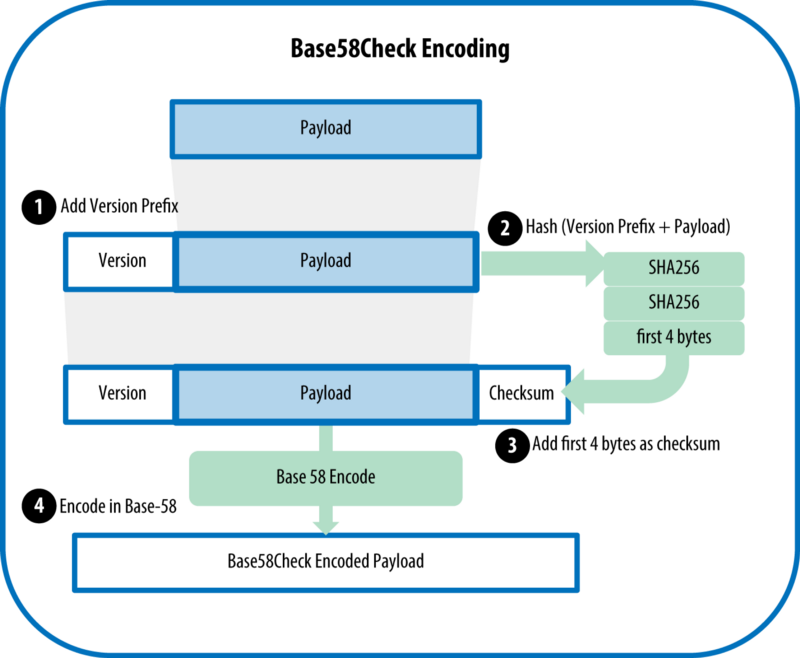
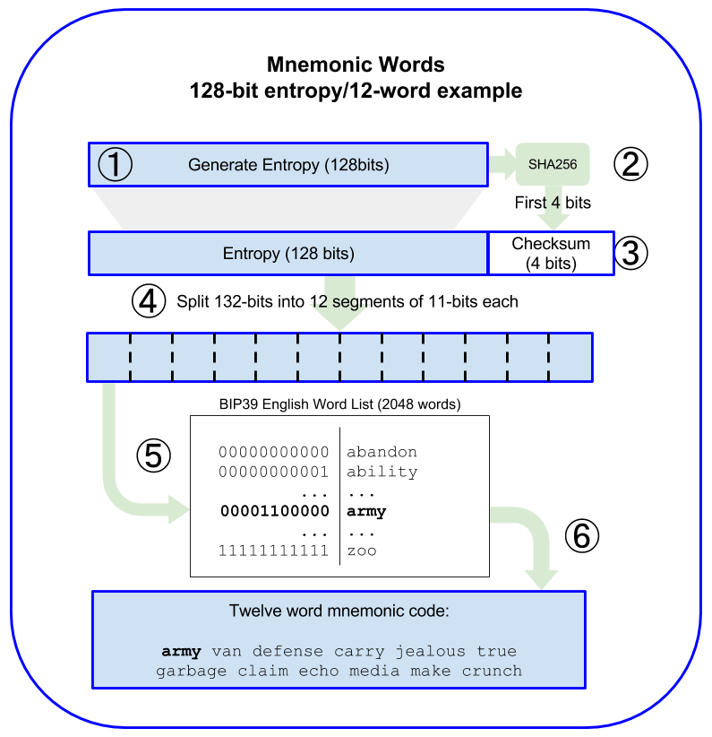

# 개인키 , 공개키, 주소

## 개인키 
- 랜덤한 256 bit로 이루어진 값
- 엔트로피가 높은 함수로 생성해야함
- 2^256 = 1.1579209e+77, 가시적 우주의 원자 개수로 표현되는 10^80과 맞먹는 숫자

## 공개키
- 개인키를 생성했으면 타원곡선 곱셈을 이용해서 공개키를 계산할 수 있다.
- 비트코인은 secp256k1을 사용한다. (어렵다 참..

## 주소
- 생선된 공개키를 통해 Double Hash(SHA-256, RIPEMD-160)한 뒤 Base58Check 인코딩을 적용
- Base58 : 58가지의 문자로 수를 표현. Base64에서 헷갈릴 수 있는 0-O(숫자 영, 대문자 오), I-l(대문자 아이, 소문자 엘), +, / 6문자를 뺀 것  

# 지갑종류
## 비결정적 지갑
- 매번 무작위 개인키를 생성하고 위의 방식으로 만들어진 새로운 주소를 사용
- 사용한 모든 개인키를 보관해야하는 아주 불편함이 있다.

## 결정적 지갑
- 하나의 시드기반으로 다른 개인키를 파생하는 방법
- 시드는 랜덤하게 생성 된 숫자로 인덱스 번호 또는 "체인 코드"와 같은 다른 데이터와 조합되어 개인 키를 유도한다

## 계층 결정적 지갑(BIP32, BIP44)
- 결정적 지갑은 단일 시드에서 많은 키를 쉽게 유도하기 위해 만들어졌다.
- 부모개인키 + 체인코드 + 인덱스 -> 자식개인키 -> 자식공개키
- 부모공개키 + 체인코드 + 인덱스 -> 자식개인키 -> 자식공개키
- 부모공개키 + 체인코드 + 인덱스 -> 자식공개키 
- 첫째, 트리 구조는 추가적인 조직적 의미를 나타내는데 사용할 수 있다. 특정 서브 키의 브랜치는 입금을 위해 사용하고,   
  다른 브랜치는 출금의 잔돈 받기 위해 사용할 수 있다. 키 브랜치는 기업 설정에도 사용할 수 있다. 부서, 자회사,   
  특정 기능 또는 회계 카테고리를 다른 브랜치로 할당할 수 있다.
- 둘째, 사용자가 개인 키에 접근하지 않고도, 연속 된 공개 키를 생성할 수 있다는 것이다.   
  자금을 사용할 수 있는 개인 키를 지갑이 가지고 있지 않기 때문에, HD 지갑은 안전하지 않은 서버나 감시 전용 또는 수신 전용으로 사용할 수 있다.

## Mnemonic(bip-39)
- 어려운 개인키를 외우기 쉽게 단어로 보여주는 것 ( 이것도 솔직히 어렵다 )
- 만드는 방법
  1. 암호학적으로 랜덤한 128 ~ 256 bits의 시퀀스 S를 만든다.
  2. S의 SHA-256 해시 값 중에서 앞(왼쪽)에서 S의 길이 / 32 bits 만큼을 체크섬으로 만든다.
  3. 2번에서 만든 체크섬을 S의 끝에 추가한다.
  4. 3번에서 만든 시퀀스와 체크섬의 연결을 11 bits 단위로 자른다.
  5. 각 각의 11 bits를 2048(2^11)개의 미리 정의 된 단어로 치환한다.
  6. 단어 시퀀스로부터 순서를 유지하면서 니모닉 코드를 생성한다. 

## 참조
 [wallet ] (https://steemit.com/kr-dev/@modolee/mastering-ethereum-4-wallet)
