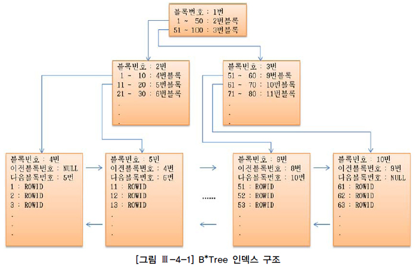

 #INDEX

## INDEX 의미
RDBMS에서 검색 속도를 높이기 위해 사용하는 기술.  
해당 TABLE의 컬럼을 색인화(따로 파일로 저장)하여 검색시 해당 TABLE의 레코드를 full scan 하는게 아니라  
색인화 되어있는 INDEX 파일을 검색하여 검색속도를 빠르게 합니다.

## INDEX 원리
INDEX를 해당 컬럼에 주게 되면 초기 TABLE생성시 만들어진 MYD,MYI,FRM 3개의 파일중에서  
MYI에 해당 컬럼을 색인화 하여 저장합니다. 물론 INDEX를 사용안할시에는 MYI파일은 비어 있습니다.  
사용자가 SELECT시 WHERE 절에 INDEX 컬럼을 사용하면 TREE로 정리 해둔 MYI파일의 내용을 검색한다.  

## INDEX 장점
- 키 값을 기초로 하여 테이블에서 검색과 정렬 속도를 향상시킵니다.
- 질의나 보고서에서 그룹화 작업의 속도를 향상시킵니다.
- 인덱스를 사용하면 테이블 행의 고유성을 강화시킬 수 있습니다.
- 테이블의 기본 키는 자동으로 인덱스 됩니다.
- 필드 중에는 데이터 형식 때문에 인덱스 될 수 없는 필드도 있습니다.
- 여러 필드로 이루어진(다중 필드) 인덱스를 사용하면 첫 필드 값이 같은 레코드도 구분할   수 있습니다.  
  참고로 액세스에서 다중 필드 인덱스는 최대 10개의 필드를 포함할 수 있습니다.
  
## INDEX 단점
- 인덱스를 만들면 .mdb 파일 크기가 늘어난다.
- 여러 사용자 응용 프로그램에서의 여러 사용자가 한 페이지를 동시에 수정할 수 있는 병행성이 줄어든다.
- 인덱스 된 필드에서 데이터를 업데이트하거나, 레코드를 추가 또는 삭제할 때 성능이 떨어집니다.
- 인덱스가 데이터베이스 공간을 차지해 추가적인 공간이 필요해진다. (DB의 10퍼센트 내외의 공간이 추가로 필요)
- 인덱스를 생성하는데 시간이 많이 소요될 수 있다.
- 데이터 변경 작업이 자주 일어날 경우에 인덱스를 재작성해야 할 필요가 있기에 성능에 영향을 끼칠 수 있다.

## INDEX 컬럼

1. 필요한 컬럼
- 자주 검색되는 컬럼
- 기본키 / 참조키
- Join에 조건절로 사용되는 키 
- 정렬의 조건으로 사용되는 컬럼

2. 필요하지 않은 컬럼
- 검색에 사용 안하는 컬럼
- 전체 중 상당 부분을 사용하는 컬럼 (남/여)
- 선택도가 많지 은 컬럼

SELECT 시에만 빠르고 INSERT/UPDATE/DELETE 에는 오히려 느려질 수 있다.  

## INDEX 주의사항
SELECT하는 경우에도 데이터 블록 수와 DB_FILE_MULTIBLOCK_READ_COUNT 값과 분포도 등에 따라  
인덱스가 빠를 경우도 있고 full table scan보다 늦어지는 경우도 있다.
1. DML에 취약함
    1. INSERT
    -   index split 현상이 발생할 수 있음.  
        index split - 인덱스의 Block들이 하나에서 두 개로 나누어지는 현상   
    1. DELETE
    -   테이블에서 데이터가 delete 될 경우 - 지워지고 다른 데이터가 그 공간을 사용 가능  
        INDEX에서 데이터가 delete 될 경우 - 데이터가 지워지지 않고, 사용 안 됨 표시만 해 둔다.  
        ->즉, 테이블에 데이터가 1만건 있는 경우, 인덱스에는 2만건이 있을 수 있다는 뜻  
        => 인덱스를 사용해도 수행속도를 기대하기 힘들다.  
    1. UPDATE
    - 인덱스에는 update 개념이 없음!!!
      테이블에 update가 발생할 경우 인덱스에서는 delete가 먼저 발생한 후 새로운 작업의 insert 작업이 발생한다.  
      delete와 insert 두 개의 작업이 인덱스에 동시에 일어나 다른 DML보다 더 큰 부하를 주게 됨.

## INDEX 종류
1. B-TREE  

