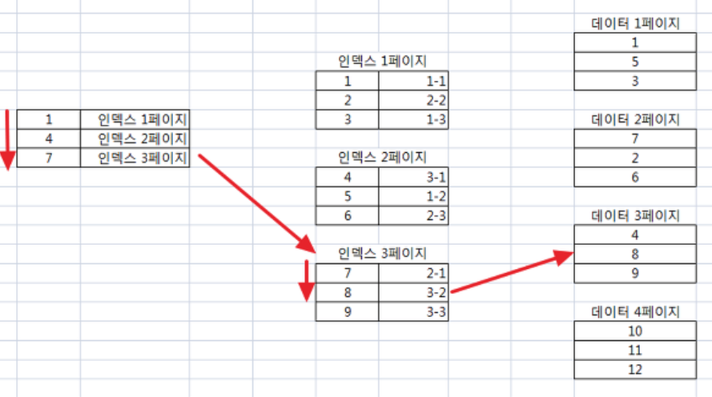
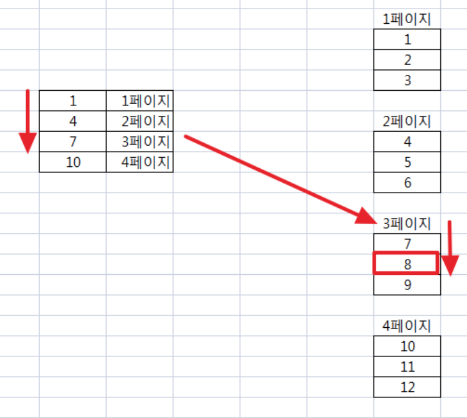

#클러스터 , 넌클러스터

## 클러스터 인덱스
- 물리적으로 행을 재배열
- 인덱스 페이지 용량이 넌 클러스터드 인덱스 페이지 용량보다 작다.
- 30% 이내에서 사용해야 좋은 선택도
- 테이블당 1개

## 넌클러스터 인덱스
- 물리적으로 재배열 하지 않는다.
- 클러스터드 인덱스 페이지 용량보다 크다.
- 3% 이내에서 사용해야 좋은 선택도
- 테이블당 249개
  
 
클러스터드인덱스는 물리적으로 행을 재배열한다. 이 말 뜻의 의미를 이해하기 위해서 테스트 테이블을 생성한 후 데이터를 저장해 보았다.  
아래와 같이 LOG_DATE, MEDIA_ID 두 개의 복합키는 자동적으로 클러스터드 인덱스로 생성이 된다.
~~~
CREATE TABLE TBL_CLUSTERED_TEST (
  LOG_DATE CHAR(8) NOT NULL,
  MEDIA_ID CHAR(1) NOT NULL,  
  PROCEEDS DOUBLE DEFAULT NULL,
  PRIMARY KEY (LOG_DATE,MEDIA_ID)
) ENGINE=INNODB DEFAULT CHARSET=utf8;
~~~

5개의 테스트 데이터를 저장해 보았다.
첫 번째 저장하는 데이터의 날짜는 6월 18일이고, 마지막에 저장되는 데이터의 날짜는 6월 13일이다.
~~~
INSERT INTO TBL_CLUSTERED_TEST (LOG_DATE, MEDIA_ID, PROCEEDS) VALUES ('20130618', 'A', 1000);
INSERT INTO TBL_CLUSTERED_TEST (LOG_DATE, MEDIA_ID, PROCEEDS) VALUES ('20130619', 'A', 1000);
INSERT INTO TBL_CLUSTERED_TEST (LOG_DATE, MEDIA_ID, PROCEEDS) VALUES ('20130619', 'C', 2000);
INSERT INTO TBL_CLUSTERED_TEST (LOG_DATE, MEDIA_ID, PROCEEDS) VALUES ('20130619', 'B', 1000);
INSERT INTO TBL_CLUSTERED_TEST (LOG_DATE, MEDIA_ID, PROCEEDS) VALUES ('20130613', 'B', 3000);
~~~

해당 테이블을 select 하면 insert 되어 있는 순서대로 데이터가 누적되어 있을까?  
아니다. LOG_DATE, MEDIA_ID는 클러스터드 인덱스로 생성이 되어 있기 때문에 물리적으로 LOG_DATE를 정렬한 후 MEDIA_ID를 정렬하게 된다.  
물리적으로 정렬을 한다는 말은 이를 두고 하는 말이다. 실제 DB의 데이터파일에 정렬이 되어 있는 상태로 디스크에 저장이 된다는 것이다.  

테이블 조회를 해보면 아래와 같이 데이터가 정렬되어 있는 것을 확인할 수 있다. (6월 13일 데이터가 가장 위에 있음)  
~~~
mysql> select * from tbl_clustered_test;
+----------+----------+----------+
| LOG_DATE | MEDIA_ID | PROCEEDS |
+----------+----------+----------+
| 20130613 | B        |     3000 |
| 20130618 | A        |     1000 |
| 20130619 | A        |     1000 |
| 20130619 | B        |     1000 |
| 20130619 | C        |     2000 |
+----------+----------+----------+
~~~

일반적으로 조회문 성능 향상을 위해서 넌 클러스터드 인덱스를 생성하여 사용하곤 한다.
허나, 이 인덱스는 클러스터드인덱스와는 다르게 물리적으로 데이터가 정렬되어 저장되지 않는다.
### 크기
넌 클러스터드 인덱스는 별도의 공간에 인덱스 테이블을 생성하여 데이터를 정렬한다.  
다음의 그림은 넌 클러스터드 인덱스에서 숫자 8을 어떻게 검색하는지에 대해서 보여준다.

클러스터드 인덱스는 이미 데이터가 정렬되어 있는 상태로 저장되기 때문에 leaf level의 인덱스 테이블이 필요치 않다.  
즉, 클러스터드 인덱스는 넌 클러스터드 인덱스보다 DB 용량을 덜 차지한다.  
다음의 그림은 클러스터드 인덱스에서 숫자 8을 어떻게 검색하는지에 대해서 보여준다.  

### 선택도
선택도라함은 테이블의 전체 데이터 집합 중에 특정 조건에 의해 데이터가 걸러지는 비율을 얘기한다.  
여기서 클러스터드 인덱스는 테이블의 데이터가 물리적으로 정렬되어 저장되어 있기 때문에 부분 범위 처리에 활용하면 적은 I/O를 통해 원하는 데이터를 추출할 수 있다.  
예를 들어서 7, 8, 9의 데이터를 추출한다고 했을 때 클러스터드 인덱스는 단 한 번의 I/O를 통해서 데이터를 추출할 수 있다. 왜냐하면 7, 8, 9는 3번 데이터 페이지에 모두 존재하기 때문이다.  
넌 클러스터드 인덱스는 leaf level 인덱스 페이지에 테이블 데이터의 위치가 저장되어 있기 때문에 테이블 데이터로 직접 access가 가능하다.  
위의 예에서 설명한 것과 같이 넌 클러스터드 인덱스에서 7, 8, 9의 데이터를 추출하게 된다면 2번의 I/O가 발생한다.  
왜냐하면 7값은 2번 데이터 페이지에 존재하고 8, 9는 3번 데이터 페이지에 존재하기 때문이다.
그래서 넌 클러스터드 인덱스는 선택도의 범위가 3% 이내일 때 효율적이다.

### 최대 갯수
클러스터드 인덱스는 물리적으로 정렬되어 있는 상태로 데이터가 저장되기 때문에 딱 1개만 생성 가능하다.   
만약 2개의 클러스터드 인덱스가 생성된다면 데이터 정렬이 꼬이기 때문에 딱 한 개만 생성할 수 있는 것이다.   
이에 반해 넌 클러스터드 인덱스는 인덱스 테이블을 별도로 생성하여 데이터를 정렬하기에  충분히(249개) 생성할 수 있다.