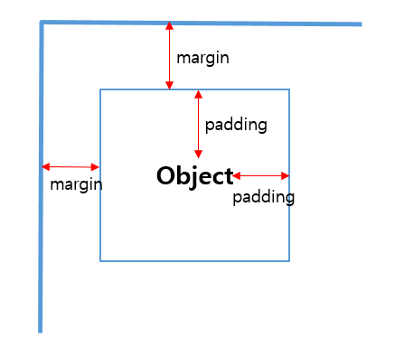

#margin, padding

두 속성 다 여백을 주는 의미에서는 같지만. 분명 다른점도 존재합니다.  
Margin, Padding 속성에 대해 정확히 알아보도록 하겠습니다.

Margin과 Padding 두가지 속성의 차이점은 위 사진 하나로 충분히 설명이 가능합니다.  
Margin은 Object와 화면과의 여백(외부여백)을 말하며 Padding은 Object내의 내부여백을 의미합니다