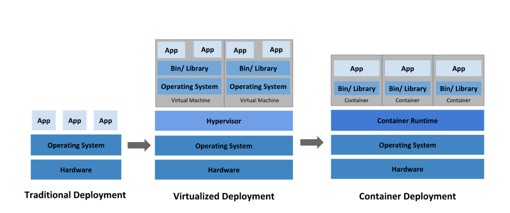

# Docker
도커는 프로그램을 생성, 배포, 실행하기 위한 오픈 소스 프로젝트이다.  
도커는 커맨드-라인을 사용하며, 백그라운드 프로세스이다.  
도커는 일반적인 소프트웨어 문제를 해결하기 위해 논리적인 접근 방식을 사용하는 원격 서비스 집합이며 소프트웨어 설치, 운영, 배포, 제거를 단순화 한다.  
도커는 컨테이너(containers)라는 운영체제에 포함된 기술을 사용하여 동작한다.  

##Container란
컨테이너는 리눅스 기술을 사용하여 선박의 컨테이너 처럼 프로세스가 사용하는 자원을 격리 하는 것입니다    

가상 환경에 익숙하다면 컨테이너를 가상 머신(VM)에 비교하여 생각하면 이해하기 쉽습니다.  
컨테이너는 가상머신과 마찬가지로 애플리케이션을 관련 라이브러리 및 종속 항목과 함께 패키지로 묶어 소프트웨어 서비스 구동을 위한 격리 환경을 마련해 줍니다.  
그러나 위의 그림에서 살펴보듯 VM과의 유사점은 여기까지 입니다.  
컨테이너를 사용하면 개발자와 IT 운영팀이 훨씬 작은 단위로 업무를 수행할 수 있으므로 그에 따른 이점도 훨씬 많습니다.

1) 가벼움
