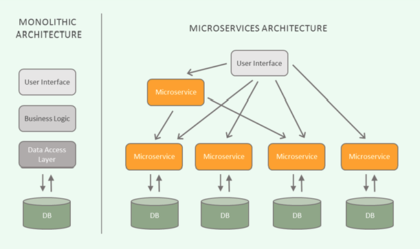

#MSA란
마이크로 서비스 아키텍쳐를 한마디로 다음과 같이 표현할 수 있습니다.

"하나의 큰 어플리케이션을 여러개의 작은 어플리케이션으로 쪼개어 변경과 조합이 가능하도록 만든 아키텍쳐"    
이것은 마치 레고놀이와 비슷하다고 볼 수 있는데요, 작은 레고블록(Microservice) 하나하나를 붙여 어떠한 큰 결과물을 만드는 형태를 MSA라고 말씀드릴 수 있겠습니다.
실질적으로 현업에서도 많이 이루어 지고 있다고 생각한다.

##Monolithic Architecture
Monolithic Architecture란 소프트웨어의 모든 구성요소가 한 프로제트에 있는 형태다 (API, VIEW등등?)

아직까지는 많은 소프트웨어가 Monolithic 형태로 구현되어 있고, 소규모 프로젝트에는 Monolithic Architecture가 훨씬 합리적입니다.  
간단한 Architecture이고, 유지보수가 용이하기 때문이죠.

1) 서비스/프로젝트가 커지면 커질수록, 영향도 파악 및 전체 시스템 구조의 파악에 어려움이 있습니다.
2) 빌드 시간 및 테스트시간, 그리고 배포시간이 기하급수적으로 늘어나게 됩니다.
3) 서비스를 부분적으로 scale-out하기가 힘듭니다.
4) 부분의 장애가 전체 서비스의 장애로 이어지는 경우가 발생하게 됩니다.

## Micro service
위 문장에서 저는 small services, each running in its own process(스스로 돌아 갈 수 있는 작은 서비스) 와,  
independently deployable(독립적 배포 가능) 이 MicroService를 설명해 줄 수 있는 가장 핵심적인 문구라고 생각합니다.

martin Fowler의 페이지를 참조하여, MSA에서의 (micro)Service를 제 나름의 생각으로 정리해 보았습니다.

1) 각각의 서비스는 그 크기가 작을 뿐, 서비스 자체는 하나의 모놀리틱 아키텍쳐와 유사한 구조를 가짐
2) 각각의 서비스는 독립적으로 배포가 가능해야함.
3) 각각의 서비스는 다른 서비스에 대한 의존성이 최소화 되어야함
4) 각 서비스는 개별 프로세스로 구동 되며, REST와 같은 가벼운 방식으로 통신되어야 함.

일반적으로 하나의 서비스는 하나의 기능이며, 하나의 프로젝트라고 볼 수 있지만,  
비즈니스와 시스템의 실정에 맞게 서비스의 범위(크기)를 설정하는 것이 중요합니다.

##MSA 장단점
1) MSA의 장점  
우선 MSA의 장점에 대해 알아보도록 하겠습니다. MSA는 서비스가 커지면서 생겼던  
Monolithic Architecture의 문제점들을 어느정도 보완해 줄 수 있습니다.

- 배포(deployment) 관점
    * 서비스 별 개별 배포 가능 ( 배포 시 전체 서비스의 중단이 없음)
        - 요구사항을 신속하게 반영하여 빠르게 배포할 수 있음.
- 확장(scaling) 관점
    * 특정 서비스에 대한 확장성이 용이함.
        - 클라우드 사용에 적합한 아키텍쳐.
- 장애(failure) 관점
    * 장애가 전체 서비스로 확장될 가능성이 적음
        - 부분적 장애에 대한 격리가 수월함  
        
이외에도, 신기술의 적용이 유연하고, 서비스를 polyglot하게 개발/운영 할 수 있다는 장점이 있습니다.

2) MSA의 단점  
Monolithic Architecture은 단순한 아키텍쳐인데 비해 MSA는 보다 복잡한 아키텍쳐로,  
전체 서비스가 커짐에 따라 그 복잡도가 기하급수적으로 늘어날 수 있습니다.

-  성능 - 서비스 간 호출 시 API를 사용하기 때문에, 통신 비용이나, Latency가 그만큼 늘어나게 됩니다.
- 테스트 / 트랜잭션 - 서비스가 분리되어 있기 때문에 테스트와 트랜잭션의 복잡도가 증가하고, 많은 자원을 필요로 합니다.
- 데이터 관리 - 데이터가 여러 서비스에 걸쳐 분산되기 때문에 한번에 조회하기 어렵고, 데이터의 정합성 또한 관리하기 어렵습니다.
