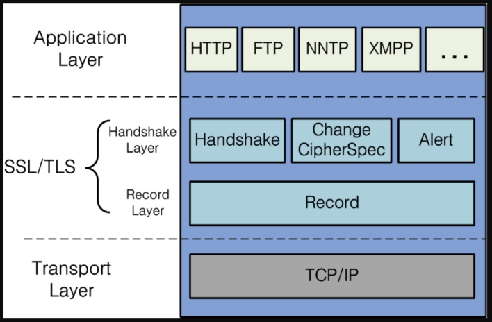
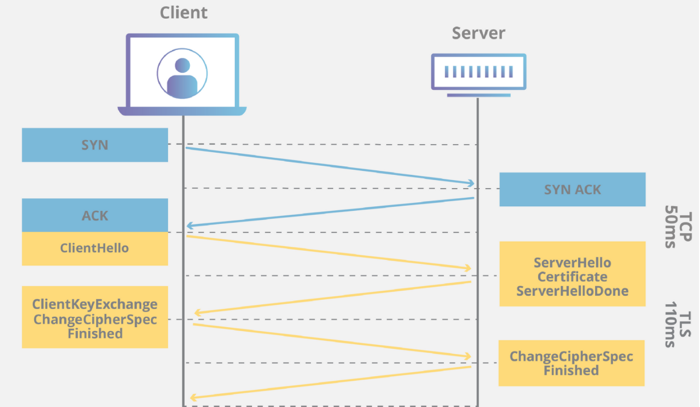
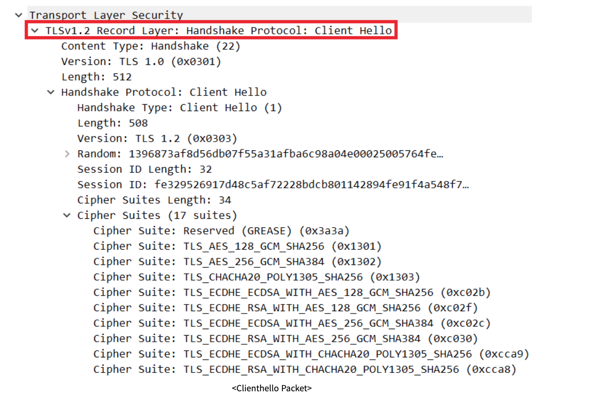
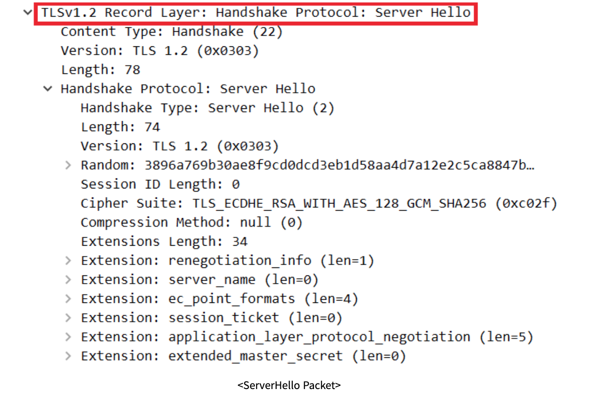

#HTTPS 

- HTTP  
    - 인터넷 상에서 정보를 주고 받기위한 프로토콜(양식과 규칙의 체계)  
    - 클라이언트와 서버 사이에 이루어지는 요청/응답 프로토콜  
    - 암호화되지 않은 방법으로 데이터를 전송한다. (악의적인 감청, 데이터 변조의 가능성)  

- HTTPS  
    - 보안이 강화된 HTTP  
    - Hypertext Transfer Protocol Over Secure Socket Layer의 약자  
    - 모든 HTTP 요청과 응답 데이터는 네트워크로 보내지기 전에 암호화된다.  
    - HTTPS는 HTTP의 하부에 SSL과 같은 보안계층을 제공함으로써 동작한다.  
    
## SSL

SSL 역시 프로토콜 중 하나로서 Secure Socket Layer 의 약자다
이름에서 알 수 있듯이 인터넷 상에서 주고 받는 데이터를 보호하기 위해 등장하였습니다.  
그러면 여기서 한 가지 의문이 생깁니다. SSL 과 HTTPS 는 같은 것이 아닐까? 라는 의문이 말이죠. 결론부터 말하면 둘은 다릅니다.

둘의 차이는 인터넷과 웹의 차이와 같습니다. 인터넷은 컴퓨터를 통해 정보를 주고 받는 네트워크라고 볼 수 있고,  
웹은 인터넷을 통해 사용가능한 서비스입니다. 마찬가지로 HTTPS 도SSL 프로토콜 위에서 돌아가는 프로토콜로서 HTTP 이 외에도 이미지에서 볼 수 있듯이   
FTP,NNTP,XMPP 등도 SSL 위에서 돌아가며 보안을 유지할 수 있습니다.

##TLS
TLS 란 SSL 와 동일하며 이름만 변경한 것 입니다.   
네스케이프에서 보안 문제를 해결하기 위해서 SSL 을 발명하였고, 이것이 표준이 되면서 TLS 라는 이름으로 바뀌게 되었습니다.   
현재는 둘을 혼용해서 사용하고 있지만 SSL 이라는 이름을 더 많이 사용하고 있으며, 오픈소스의 이름 역시도 OpenSSL 입니다.

##암호화 방식
- 대칭키
    - 하나의 비밀키를 양쪽(client & server)가 모두 같이 사용
    - 암호화와 복호화에 사용하는 키가 같은 암호화 알고리즘
    - 공개키와 비밀키를 별도로 가지는 것과 구별되는데, 이와 비교하면 계산속도가 빠르다는 장점 
    - 비밀키 하나만 알아내면 암호화된 내용을 해독 가능 → 해커로부터 안전 X
    - 비밀키를 어떻게 client와 server가 안전하게 보유하는지가 관건 
    
- 공개키 
    - 비밀키 하나 만 가지는 대칭키 암호 방법과 달리, 공개키와 비밀키 두 개가 존재
    - 공개키 암호를 구성하는 알고리즘을 대칭키 암호 방식과 비교하여 비대칭 암호라고 불림
    - 암호화와 복호화에 사용하는 키가 서로 다름
    - 암호화할 때의 키는 공개키(public key), 복호화할 때의 키는 개인키(private key) (반대로도 사용함)
    - 공개키는 누구나 알 수 있지만, 그에 대응하는 비밀키는 키의 소유자만이 알 수 있어서 
       특정한 비밀키를 가지는 사용자만이 내용을 열어볼 수 있도록 하는 방식.
    - 공개키로 암호화한 메세지는 수신자의 개인키로만 해독할 수 있으므로 안전하게 상대방에게 메세지를 전달해 줄 수 있음.
    - 대칭키(비밀키)알고리즘에 비하여 속도가 느리다. (약 1000배 그래서 HTTPS 통신에서 둘 다 사용한다!)
    - 속도가 느리기 때문에 긴문서의 암호화하는 경우보다 대칭키 알고리즘의 키값에 대한 암호에 사용.

##HTTPS 통신 정리

SSL Handshake의 과정을 그린 그림을 가져왔습니다. 여기 파란색과 노란색 칸은 네트워크 상에서 전달되는 IP Packet을 표현한 것입니다.   
맨 윗줄의 SYN, SYN ACK, ACK는 TCP layer의 3-way handshake로 HTTPS가 TCP 기반의 프로토콜이기 때문에 암호화 협상(SSL Handshake)에 앞서   
연결을 생성하기 위해 실시하는 과정이고 아래 노란색 상자의 패킷들이 SSL Handshake입니다. 
통신이 끝난뒤엔 4-way handshake를 한 후 종료한다.

1) Client Hello
Client가 Server에 SSL 연결을 시도하며 전송하는 패킷입니다. 자신이 사용 가능한 Cipher Suite 목록, Session ID, SSL Protocol Version, Random byte 등을 전달합니다.  
Cipher Suite는 SSL Protocol version, 인증서 검정, 데이터 암호화 프로토콜, Hash 방식 등의 정보를 담고 있는 존재로 선택된 Cipher Suite의 알고리즘에 따라 데이터를 암호화하게 됩니다.   
아래 사진을 보면 Client가 사용 가능한 Cipher Suite를 Sever에 제공하는 것을 알 수 있습니다.

2) Server Hello
Client가 보내온 ClientHello Packet을 처리한 후, Cipher Suite 중 하나를 선택한 후 Client에게 이를 알립니다.  
또한 자신의 SSL Protocol Version 등도 같이 보냅니다. 아래 사진을 보면 ClientHello에서 17개였던 Cipher Suite와 달리 아래에서는 Server가 선택한 한 줄만이 존재하는 것을 알 수 있습니다.

## SSL 인증서
클라이언트와 서버간의 통신을 공인된 제3자(CA) 업체가 보증해주는 전자화된 문서

- 참조   
https://m.blog.naver.com/alice_k106/221468341565  
https://aws-hyoh.tistory.com/entry/HTTPS-%ED%86%B5%EC%8B%A0%EA%B3%BC%EC%A0%95-%EC%89%BD%EA%B2%8C-%EC%9D%B4%ED%95%B4%ED%95%98%EA%B8%B0-3SSL-Handshake  
https://gaeko-security-hack.tistory.com/123
