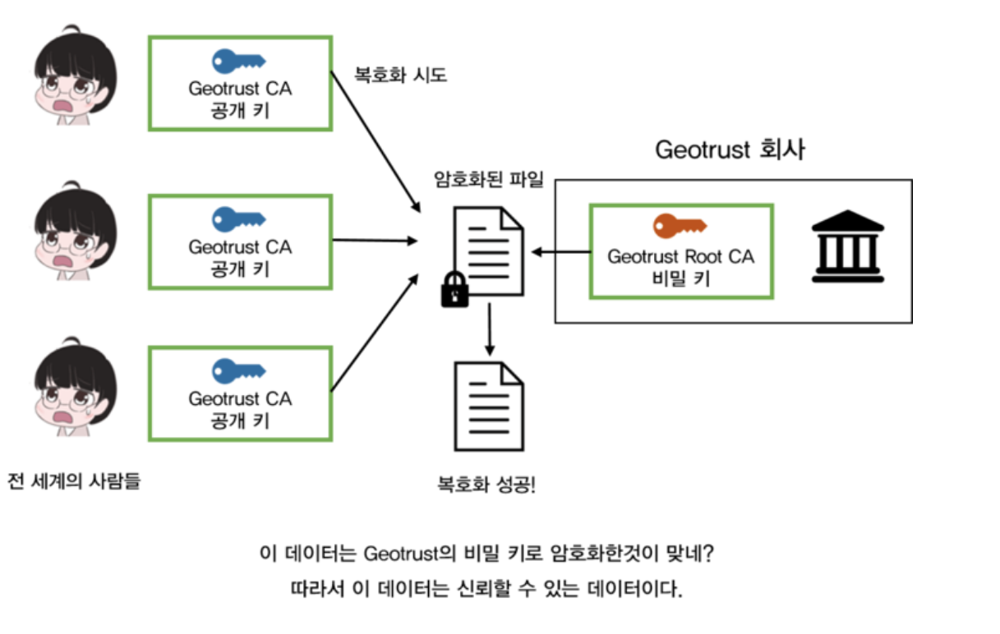

#SSL 인증서

## 왜 사용하는가?
오늘날 많은 서비스들이 네트워크를 통해 패킷을 주고 받는다.  
통신 하는 도중에 많은 라우터와 스위치를 거치게 되는데 누군가 패킷을 훔쳐서 중요한 데이터를 볼 수 있다.  
그래서 나온 방식이 SSL/TLS 암호화 방식을 사용하여 인증서라는 일종의 서명을 사용한다.  
이 인증서는 제공 한 Sever가 신뢰 할수 있는 사람인지에 대한 확인 용도 이며, 패킷 데이터를 암호화하기 위한 첫 단계라고 생각하면 된다.  

인증서가 신뢰할 수 있다는 검증 작업을 거치고 나서야 비로소 데이터 암호화 작업이 수행된다. 그 과정이 SSL 보안 통신이라고 불리는 것이며,   
이론상 이를 해독하는 것이 거의 불가능하기 때문에 오늘날 다양한 보안 연결에서 사용되고 있다.   
우리가 흔히 사용하고 있는 (그렇지만 잘 인지하지 못하고 있는) 보안 연결은 다름아닌 웹 브라우저 <-> 웹 사이트 간 연결이다.

## 인증서의 구조 
이 세상에는 무조건 신뢰할 수 있는 기관이 있고 최상위 인증기관이라 부르면 Root CA라는 인증서를 발급하는 기관이다.  
예를 들어 Symantec, GoDaddy, Comodo, GlobalSign, DigiCert, StartCom, Geotrust 같은 회사이다.
참고로 우리나라는 GlobalSign가 점유율 1위이다.

이 기관들은 본인들만의 고유한 비밀 키를 가지고 있고, 이에 대응하는 공개 키를 전 세계에 배포한다.   
그리고 세상 사람들은 암묵적으로 이 기관들은 신용할 수 있음을 서로 약속하고, 배포된 Geotrust의 공개 키로 복호화가 가능한 데이터는 Geotrust의 비밀키로 암호화되었기   
때문에 신용할 수 있는 데이터라고 간주한다. 물론 Geotrust의 비밀 키는 철저한 보안 속에서 절대로 유출되지 않아야만 한다는 전제 조건이 필요하긴   
하지만, 이러한 기관은 보안을 전문으로 하는 회사이기 때문에 보통은 안전하다고 생각하면 된다. 

일반적으로 이렇게 신뢰 가능하다고 여겨지는 기관의 공개 키는 여러분의 컴퓨터에 이미 설치되어 있는 경우가 많다.   
Mac OS 라면 키체인에 있을 것이고, 여러분의 웹브라우저인 파이어폭스, 크롬 등에도 Geotrust의 공개 키는 이미 내장되어 있다. 

### 인증서의 내용물  
상대방이 신뢰할 수 있는지 검증하기 위해 존재하는 '인증서' 라는 포맷의 파일에 대해서 먼저 알아보자. 인증서 파일 안에는 다양한 내용이 저장되어 있으며, 대표적인 내용물은 아래와 같다.  
(1) 인증서의 소유자 이름,   
(2) 인증서 소유자의 공개 키 (당연히 비밀 키는 소유자가 가지고 있다),   
(3) 인증서의 유효 기간,   
(4) 고유한 UID  
(5) 인증서의 기타 모든 값들을 해시화한 값  

그리고 가장 중요한 것은, (5) 의 값 : 인증서의 내용을 종합해 해시화한 값을 암호화한 값 (지문) 이 마지막으로 인증서에 기록된다.   
이 지문 값에 대해서는 뒤에서 다시 언급한다. 어쨌든, 인증서라는 것은 하나의 파일이며 그 안에는 위와 같이 여러 정보가 담겨져 있다고 알고 넘어가자. 

### 인증서 검증 방법  

인증서는 계층 구조로 되어 있다. 보통 3계층 구조로 되어 있고, 가장 최상위에 위치한 인증서는 일반적으로 Root 인증서라고 불린다.   
이러한 Root 인증서는 세상 사람들이 모두 신뢰하기로 약속한 기관, 예를 들어 위에서 언급한 Geotrust 등의 기관에서 발행한 인증서가 된다.   
이러한 인증서는 일반적으로 웹 브라우저 등에 미리 내장되어 있으며, 해당 인증서에 대응하는 공개 키 또한 인증서 내부에 포함되어 있다.

1) Google CA인증서 내용물 1~4번을 해쉬한 값을 Root CA에게 개인키를 사용하용하여 암호화 해달라고 한다.
2) Root CA의 공개키는 전세계 사람들이 가지고 있으므로 암호화 한 값을 공개키로 복호화 할 수 있다.
3) 복호화에 성공 했다면, Google CA의 인증서의 내용물에 대한 해시 값을, Root CA가 Root CA의 비밀 키로 암호화 해준것일테니, Google CA 또한 신뢰할 수 있다
4) 이러한 원리를 Chain Of Trust 라고 부른다. 상위 계층의 인증서가 신뢰 할 수 있는 기관이라면 하위 인증서 들도 신뢰가능하다고 간주 한다.  
5) 3번에서 복호화에 성공했다 하더라고 , 만약 복호화한 해시값과 1~4번을 해쉬한 값을 비교 했을 때 다르다면 해당 인증서의 내용물은 변조 되었음을 의미한다!

상위 인증서 기관의 공개 키로 하위 기관의 인증서 해시 값을 복호화 한다는 것은 두 가지 효과를 얻을 수 있음을 알 수 있다.
1) Chain of Trust의 원리에 의해 하위 인증서가 신뢰할 수 있는지를 알 수 있으며
2) 하위 인증서의 내용물이 변조되었는지를 알 수 있게 된다.

### 참조
- https://m.blog.naver.com/alice_k106/221468341565
