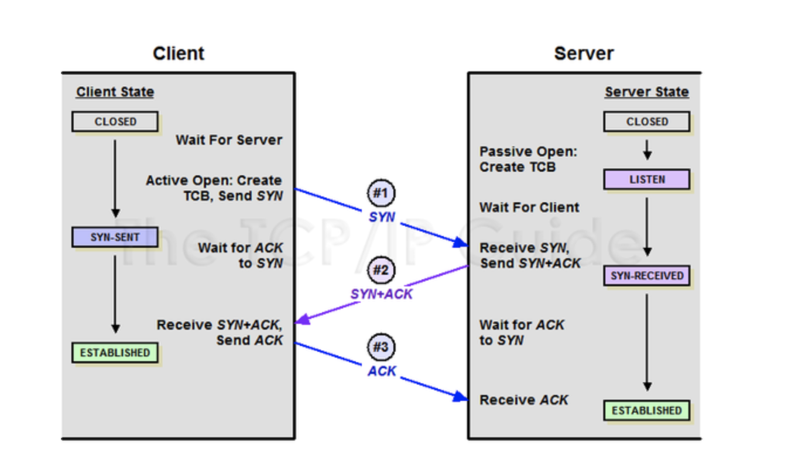
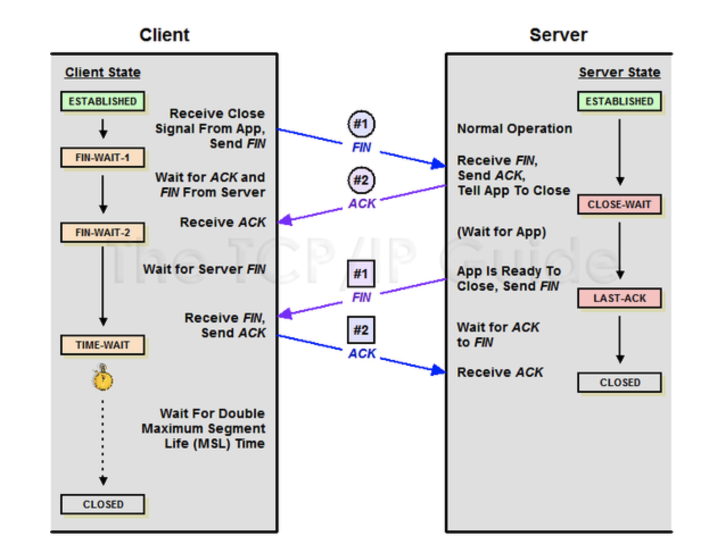

#TCP/IP

## TCP / IP 4계층   
TCP/IP란 인터넷과 관련된 다양한 프로토콜의 집합을 의미하며, OSI 7 계층을 4계층으로 단순화한 모델을 말합니다.
TCP/IP는 TCP 프로토콜과 IP 프로토콜이 각각 전송 계층, 인터넷 계층에서 "케이블 규격, IP 주소 지정방법,   
통신 대상을 찾는 방법과 그곳에 도달하기 위한 순서 등"을 제어하는 역할을 합니다.

그런데 OSI 7 계층이든, TCP/IP 4 계층이든지 계층화를 하는 이유는 무엇일까요?
계층별로 담당하는 역할을 나누어서 계층에 존재하는 각 프로토콜이 자신의 기능만 충실히 하도록 하여 독립성을 보장하기 위해서입니다.
즉, 만약 문제가 발생했을 때 해당 계층만 파악하면 되므로 독립성을 보장하기 위함입니다.
참고로 3 Layer Architecture, MVC 구조 등 이렇게 계층을 나누는 것은 모두 독립성을 보장하기 위해서입니다.

TCP/IP 4계층에서 각 계층이 하는 역할은 다음과 같습니다.

- 링크 계층  
인터넷 계층에서 형성된 패킷을 전기신호 또는 광신호로 바꾸어 전달하는 역할을 합니다.

- 인터넷 계층
IP( Internet Protocol ) 프로토콜은 인터넷 계층에 존재하며, 링크 계층을 통해 물리적으로 연결된 호스트 사이에서 패킷의 전달 경로를 결정합니다.  
즉, IP 프로토콜은 라우팅 방법을 정의하는 것인데, 상위 계층인 전송 계층이 데이터 전달의 신뢰성을 책임진다는 가정하에  
어떤 경로로 패킷을 전송할 것인가에 초점을 둡니다.

- 전송 계층
전송 계층은 인터넷 계층에서 결정한 목적지까지 실제 데이터를 신뢰성 있게 전송하는 역할을 합니다.  
전송 계층에는 TCP와 UDP라는 프로토콜이 존재하는데, 두 프로토콜의 차이점은 조금 뒤에서 살펴보도록 하겠습니다.  

- 응용 계층
응용프로그램들 간의 데이터 통신이 이루어지는 계층입니다.  
예를 들어, 메일보내기( SMTP ), 파일 전송( FTP ), 웹에 접속( HTTP ) 등이 있으며, 괄호안의 프로토콜은 각각의 통신에 사용되는 프로토콜입니다.  

## TCP, UDP 프로토콜

- TCP 프로토콜
TCP 프로토콜은 연결 지향 프로토콜입니다.  
TCP 프로토콜에서는 데이터 송수신을 위해 클라이언트와 서버의 소켓이 연결되어 있어야 하며, 데이터가 유실되면 데이터 재전송을 요청함으로써 신뢰성을 보장합니다.  
즉, 신뢰성 있는 데이터 전송이 가능하다는 장점으로 인해 HTTP, FTP, TELNET 등 대부분의 응용 계층 프로토콜의 전송 계층으로 사용 됩니다.  

- UDP 프로토콜  
반대로 UDP 프로토콜은 비연결 지향 프로토콜입니다.  
전송한 데이터가 잘 전달이 되었는지 확인하지 않고 단지 데이터만 보낸다는 점이 TCP 프로토콜과 다릅니다.  
즉, 신뢰적이지 않으며( 비신뢰성 ), 대신 속도가 빠르다는 장점이 있습니다.  
그렇다고 UDP 프로토콜이 아예 신뢰성이 없다는 것은 아닙니다. ( 헤더에 checksum 존재 )  
그래서 UDP 프로토콜은 음악이나 동영상 스티리밍(streaming)과 같은 서비스에 적합합니다.  

정리하면 다음과 같습니다.

TCP 프로토콜은 연결 지향적이며, 신뢰성이 보장된다는 특징이 있습니다.  
UDP 프로토콜은 비연결 지향적이며, 성능이 빠르다는 특징이 있습니다.  

##3. TCP 연결 / 해제
  
TCP / IP 프로토콜은 OS안에 라이브러리로 내장되어 있습니다.
즉, 연결을 위한 3 way handshake와 종료를 위한 4way handshake 과정은 OS에서 알아서 처리하는 것이라 할 수 있습니다.
  
또한 소켓( Socket )은 응용 계층이 하위 계층인 TCP/IP 계층의 역할을 몰라도 되도록 TCP/IP의 역할을 감추어주는 역할을 합니다. ( 투명성 )
즉, 소켓은 프로그래머가 커널 내부를 몰라도 TCP/IP를 사용할 수 있도록 하는 TCP/IP 프로토콜 인터페이스라고 생각하면 됩니다.
  
TCP 프로토콜은 클라이언트와 통신을 하기 전에 3 way handshake( 3번의 악수 )를 통해 연결을 맺고, 연결을 종료할 때는 4 way handshake를 통해 연결을 끊습니다.
다음으로 각각의 TCP 연결/해제의 과정에 대해 알아보도록 하겠습니다.

- 3way handshake

1) 연결을 하기 전 클라이언트와 Closed 상태이고, 서버는 요청을 기다리고 있는 LISTEN 상태입니다.
2) 클라이언트에서 서버에 연결을 요청하는 SYN 데이터를 전송합니다.
3) 서버가 SYN을 받으면 잘 받았다는 ACK 데이터와 함께 클라이언트 쪽에서도 포트를 열어 달라는 SYN데이터를 보냅니다.
    - 그러면서 서버는 LISTEN 상태에서 요청을 받고 상대방의 응답을 기다리는 SYN_RCV로 상태가 변경 됩니다.
4) 클라이언트에서 서버로부터 ACK + SYN 데이터를 받으면, 클라이언트는 포트를 열고 이에 대한 확인으로 서버에 ACK 데이터를 보냅니다.
    - 그러면서 클라이언트는 ESTABLISHED 상태로 바꿉니다. 
5) ACK 데이터를 받은 서버 역시 ESTBALISHED 상태로 변경되면서, 클라이언트와 서버는 연결이 됩니다.
이렇게 3-way handshake라는 과정을 통해 클라이언트와 서버는 신뢰성 있는 통신을 할 수 있게 됩니다.  

- 4way handshake

TCP 연결을 위해 3 way handshake 를 통해 ESTABLISHED 하는 것과 달리 서로의 연결을 종료할 때는 4 way handshake 를 수행합니다.  
아무래도 새로 연결을 할 때보다 연결되어 있는 상황에서 종료할 때 예기치 못한 상황이 많기 때문에, 과정이 더 까다로운 것 같습니다.

1) 최초에는 서로 통신 상태이기 때문에 양쪽이 ESTABLISHED 상태입니다.
2) 클라이언트가 통신을 종료하자는 FIN 데이터를 보내고, 자신의 상태를 종료요청 후 ACK를 기다리고 있다는 의미로 FIN_WAIT_1 상태로 바꿉니다.
3) 서버는 알겠다는 의미로 클라이언트에 ACK 데이터를 보내면서 애플리케이션의 소켓을 닫습니다.
    - 이 때 자원을 정리하는데 시간이 소요 되므로, 소켓을 닫는데 기다리고 있는 상태라는 의미에서 CLOSE_WAIT 상태로 바꿉니다.
    - 그 동안 연결 종료를 요청한 클라이언트는 서버로부터 응답이 올 때까지 기다리고 있다는 FIN_WAIT_2 상태가 됩니다.
4) 애플리케이션에서 소켓을 닫으면, 서버는 클라이언트로 FIN 데이터를 보냅니다.
    - 그리고 자신은 클라이언트로부터 마지막 ACK를 기다리고 있는 LAST_ACK 상태가 됩니다.
5) 클라이언트는 FIN 데이터를 받으면 TIME_WAIT 상태로 바꾸면서 서버에 ACK 데이터를 보냅니다.
    - 클라이언트는 TIME_WATE 상태에서 일정 시간이 되면 CLOSED 상태가 됩니다.
6) ACK 데이터를 받은 서버 역시 CLOSED 상태가 됩니다.