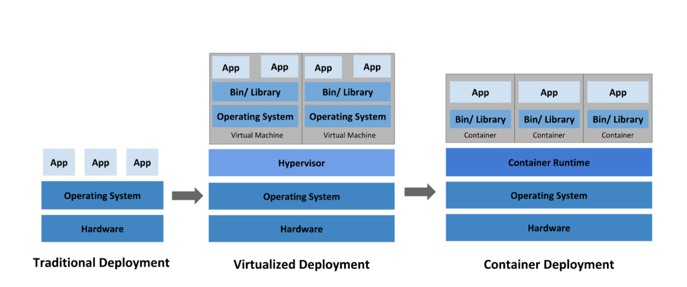

# Docker
도커는 프로그램을 생성, 배포, 실행하기 위한 오픈 소스 프로젝트이다.  
도커는 커맨드-라인을 사용하며, 백그라운드 프로세스이다.  
도커는 일반적인 소프트웨어 문제를 해결하기 위해 논리적인 접근 방식을 사용하는 원격 서비스 집합이며 소프트웨어 설치, 운영, 배포, 제거를 단순화 한다.  
도커는 컨테이너(containers)라는 운영체제에 포함된 기술을 사용하여 동작한다.  

## 탄생배경
1) 1960년 가상화 개념이 처음 등장함
2) 서버의 성능이 좋아져서 서버의 노는 시간이 증가
3) 서버에 여러개의 가상머신을 띄워서 일을 더 시킴
4) 가상머신에 서버, DB등 설치하여 이미지화 하여 어려서버에 설치 함
5) 가상화를 이용하여 서버를 임대해주는 서비스가 클라우드 서비스
6) 하나의 컴퓨터를 만들다보니 각종 성능 손실 발생, 반가상화도 나왔지만 느림, 호스트OS위에 게스트 OS를 또 설치해야 해서 무거움
7) 그래서 리눅스 컨테이너가 등장함 
8) 컨테이너 안에 가상공간은 만들지만 실행 파일을 호스트에서 직접 실행함 (cgroups와 namespaces기술 덕)
9) 도커는 리눅스 컨테이너라는 기술을 사용함 (초기에는 리눅스 컨테이너로 구현했으나 0.9v부터 libcontainer를 사용)

##Container란
컨테이너는 리눅스 기술을 사용하여 선박의 컨테이너 처럼 프로세스가 사용하는 자원을 격리 하는 것입니다    

가상 환경에 익숙하다면 컨테이너를 가상 머신(VM)에 비교하여 생각하면 이해하기 쉽습니다.  
컨테이너는 가상머신과 마찬가지로 애플리케이션을 관련 라이브러리 및 종속 항목과 함께 패키지로 묶어 소프트웨어 서비스 구동을 위한 격리 환경을 마련해 줍니다.  
그러나 위의 그림에서 살펴보듯 VM과의 유사점은 여기까지 입니다.  
컨테이너를 사용하면 개발자와 IT 운영팀이 훨씬 작은 단위로 업무를 수행할 수 있으므로 그에 따른 이점도 훨씬 많습니다.

1) 가벼움  
가상화와 다르게 게스트 OS가 필요없이 호스트에서 바로 실행하기에 가벼움.
2) 탄력성  
컨테이너는 리눅스,windows 등 어느 환경에서가 구동되므로 개발 및 배포가 쉬워짐
3) 유지관리 효율
운영 체제 커널이 하나밖에 없기 때문에 운영 체제 수준에서 업데이트 또는 패치 작업을 한 번만 수행하면 변경 사항이 모든 컨테이너에 적용됩니다.  
이를 통해 서버를 더 효율적으로 운영하고 유지 관리할 수 있습니다.  
