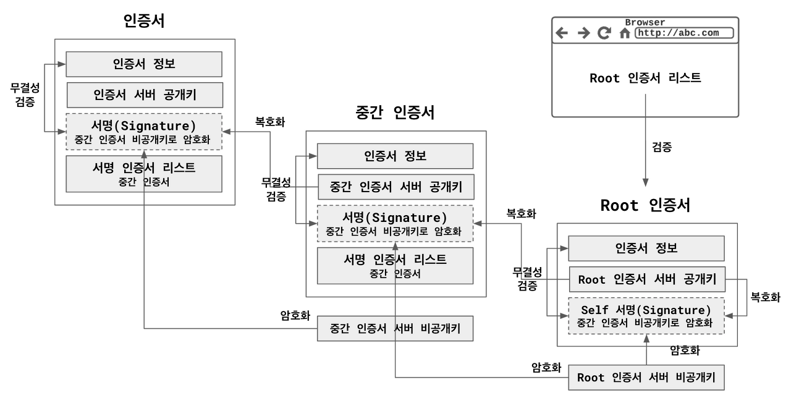

##  인증서 체인

### 인증서 체인  
인증서를 신뢰할 수 있도록 서명을 하며 만들어진 체인으로
일반적으로 3계층 / 인증서 - 중간 인증서 - Root 인증서로 구성

- 인증서(Leaf Certificate) 
  - HTTPS 서비스를 위하여 발급 받은 인증서서로 서비스가 올라간 서버에 적용, 중간 인증서에 인증서 정보가 Hash된 값을 전달하여 서명(중간 인증서 서버 비공개키로 암호화) 요청

- 중간 인증서(Intermediate Certificate) 
  - 인증서를 서명해줌, Root 인증서에 의해 서명 된 상태

- Root 인증서(Root Certificate) 
  - 중간 인증서를 서명해줌, 본인의 서버 공개키로 Self 서명 된 상태, 브라우저들은 신뢰하는 Root 인증서 리스트를 가지고 있음(인증서에 따라 Self 서명이 아닌 다른 Root 인증서와 교차 서명하기도 함)

- 인증 기관(Certificate Authoirty) 
  - 서명을 해주는 기관

- 서명(Signature) 
  - Hash된 값을 상위 인증서 서버 비공개키로 암호화 후 상위 인증서 서버 공개키로 복호화하여 상위 인증서가 본인의 서버 비공개키로 암호화 해줌을 확인하고 Hash된 값을 비교하여 인증서의 무결성을 확인

