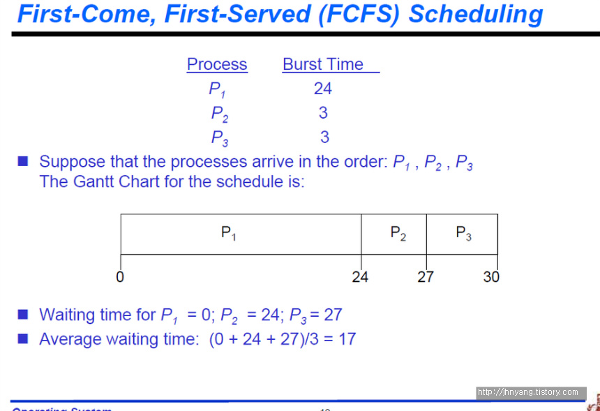

## FIFO(first in first out) = FCFS(first come first served)
   
제일 첫 번째 나오는 알고리즘이 FCFS 또는 FIFO라고 불리는 알고리즘입니다.   
말 그대로 들어오는 순서대로 처리하는 알고리즘이예요. A프로세스가 들어오고, B프로세스가 들어오고 하면 A먼저 처리하고 그 다음 B먼저 처리하고 하는거죠.   
이게 왜 모든 스케줄링의 알고리즘에 제일 첫 번째로 나올까요?

이 알고리즘이 제일 FAIR한 시스템이기 때문이예요.   
먼저온 사람이 먼저 할당받는거니 공평하죠! 그렇기 때문에 첫 번째로 나옵니다. (스케줄링 목표에서 FAIR를 다뤘었어요!)

그런데 이게 fair하긴 하지만 어떤 특정한 경우에는 적합하지 않은 경우가 많이 있어요.   
그렇지만 일반적으로 가장 fair하기 때문에 문제를 제기하지 않는 그런 스케줄링 알고리즘이 FCFS입니다.

Suppose that the processes arrive in the order P1, P2, P3  
거의 동시에 1,2,3의 순서로 왔다. 거의 동시에 왔는데 이 순서대로 도착했다라는거예요.  
그러니까 1,2,3, 순서로 처리를 하는것이 FIFO입니다.

그런데 이렇게 스케줄링을 하면 P1의 waiting time은(= ready queue에서 기다리는 시간 저번 포스트에서 다뤘었죠!) 얘는 바로 실행되었으니까 0이겠죠.   
P2는 저P1이 수행되는만큼 기다렸다가 수행을 할거니까 P1의 waiting time은 24예요.
P3는 이만큼 기다렸으니까 P3은 27이 됩니다. (그래프의 그림을 보시면 이해하기 편해요)
이 3개의 average waiting time을 구하면 17이 됩니다.

##Convey effect

Convoy Effect is phenomenon associated with the First Come First Serve (FCFS) algorithm, 
in which the whole Operating System slows down due to few slow processes.

앞의 내용을 이해했으면 이거는 아는 내용이예요.
내 앞에 엄청 긴 process가 있어서 내 waiting time이 엄청나게 길어지는 그런 현상을 우리가 convoy effect라고 하는 거거든요!

요약
- 대기 큐에 도착한 순서에 따라 CPU를 할당한다.
- 일단 프로세스가 CPU를 차지하면 완료될 때까지 수행한다.
- 긴 작업이 짧은 작업을 오랫 동안 기다릴 수 있으며, 중요하지 않은 작업이 중요한 작업을 기다리게 할 가능성이 존재한다.
- 대화식 Real time 시스템에는 부적합햐다.

