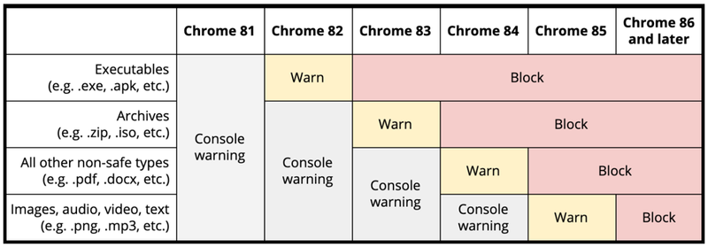

# 크롬 혼합컨텐츠 차단

작년 구글은 Chrome 브라우저의 안전한 웹 환경을 만들기 위해 혼합 콘텐츠(Mixed content)차단에 대해 발표를 하였습니다.  

그리고 2020년 구글은 혼합 콘텐츠(Mixed content)차단과 연관된 추가 계획을 발표하였으며,  
" 추가된 내용은 혼합 콘텐츠(Mixed content)의 http 다운로드 차단입니다."  

인증서가 설치되어 있고 https로 설정이 된 웹 사이트에서 http 콘텐츠가 혼합되어 있는 경우 "혼합 콘텐츠(Mixed content)" 라고 합니다.    

이런 혼합 콘텐츠(Mixed content)의 경우 다운로드 링크가 http 일 때 사용자에게 알리는 표시가 없으므로 대부분의 사용자는 해당 위험성을 알 수 없습니다.     

Google은 이 부분을 https 보안에 있어 가장 큰 문제로 인식하고 Chrome 브라우저를 사용 시 https 웹 사이트에서 http 다운로드를 차단하여 이를 보완하기로 발표했습니다.  

  
  
구글이 발표 한 계획에 따르면, 2020년 6월에 출시예정인 Chrome 83 버전은 .exe 같은 실행파일을 차단합니다.  

그리고 이후에 출시될 Chrome 버전에서는 다른 파일형식이 포함되며, 2020년 10월에 출시예정인 Chrome 86버전에서는 모든 파일 형식이 차단될 예정입니다.  

따라서 2020년 10월 이후 업데이트되는 Chrome 86 버전부터 https로 설정된 웹 사이트에서 http다운로드 링크를 제공한다면 파일을 다운로드 할 수 없습니다.  

Google은 데스크톱 플랫폼 (Windows, macOS, Chrome OS 및 Linux)에서 혼합 콘텐츠 다운로드에 대한 제한을 적용 할 계획입니다. 데스크탑 플랫폼에 대한 계획은 다음과 같습니다.  

모바일(Android 및 iOS)의 경우 Chrome 83에서 경고가 표시될 예정입니다.  

## Chrome 81~86 의 단계적  차단

- Chrome 81 (2020년 3월 출시)
    - 모든 혼합 콘텐츠 다운로드에 대한 콘솔 메시지 경고를 표시

- Chrome 82 (2020년 4월 출시)
    - 실행 가능한 콘텐츠 (예: .exe) 의 혼합 콘텐츠 다운로드에 대해 경고
    
- Chrome 83 (2020년 6월 출시)
    - 혼합 콘텐츠 실행파일을 차단
    - 혼합 콘텐츠 보관함(.zip)과 디스크 이미지(.iso)에 대해 경고

- Chrome 84 (2020년 8월 출시)
    - 혼합 콘텐츠 보관함(.zip)과 디스크 이미지(.iso)를 차단
    - 이미지, 오디오, 비디오 및 텍스트 형식을 제외한 다른 모든 혼합 콘텐츠 다운로드에 대해 경고

- Chrome 85 (2020년 9월 출시)
    - 이미지, 오디오, 비디오 및 텍스트 의 혼합 콘텐츠 다운로드에 대해 경고
    - 다른 모든 혼합 콘텐츠 다운로드를 차단

- Chrome 86 (2020년 10월 출시)
    - 모든 혼합 콘텐츠 다운로드를 차단