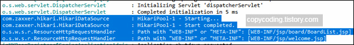

#Boot에서 JSP 연동하기

Spring Boot에서 jsp로 화면을 만들고 Controller에서 View로 리턴을 하였는데 jsp 파일을 찾지 못하는 경우  
ResourceHttpRequestHandler :Path with "WEB-INF" or "META-INF" 이런 식으로 발생하는 오류입니다.   
브라우저에는 Whitelabel Error Page가 불러오고 로그창에는 
  
확인된다. 

해결방법
 - 컨트롤러를 만들었는가
~~~
@Controller
public class MainController {

@RequestMapping(value="/")
public String main() throws Exception { 
return "/index";
}
}
~~~
 - JSP 를 src/main/webapp/WEB-INF/views 에 위치
 - application.properties 에 선언
~~~
spring.mvc.view.prefix: /WEB-INF/views
spring.mvc.view.suffix: .jsp
~~~

3.의존성 추가 

사실 오류라기 보다는 Spring Boot에서 내장된 Tomcat을 사용 하는 경우 JSP를 처리하는 서블릿을 추가하지 않아 발생하는 것으로 pom.xml에 다음을 추가해 주면 해결 됩니다.
~~~
 <dependency>
        <groupId>org.apache.tomcat.embed</groupId>
        <artifactId>tomcat-embed-jasper</artifactId>
</dependency>

compile('org.apache.tomcat.embed:tomcat-embed-jasper')
compile('javax.servlet:jstl:1.2')
~~~

pom.xml에 추가하고  Maven을 update 하고 Maven을 install 하고 실행해 보면 이번에는 화면에 출력이 잘 나옵니다.
4. IDE 껐다 키기...
