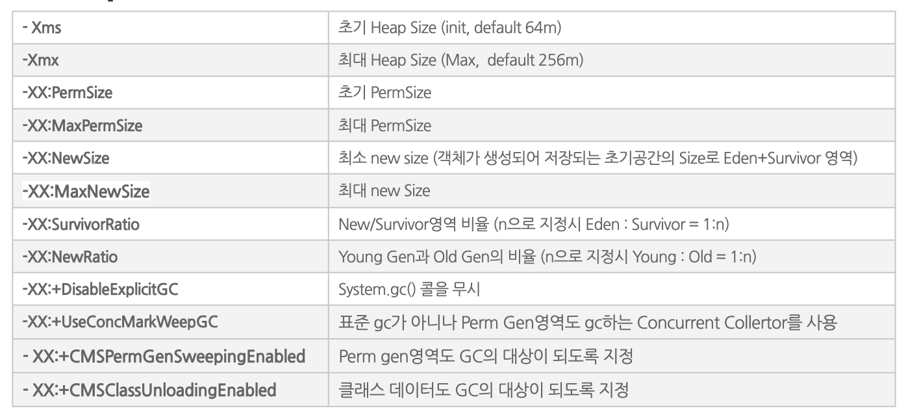

#JVM 메모리 
상품수집 배치에서 사이즈 큰 파일들을 다루다 보니 OOM메모리 에러를 많이 봤다.
그럴때 마다 JVM 설정을 변경해 주었는데, 이참에 각 옵션별로 정리 해야겠다.

## JVM 메모리 구조
- Heap = Edn + Survivor + Old
- Non-Heap = Perm 이다. 

메모리는 우선, Heap과 Non-Heap 으로 나뉜다. 상세 역할과 구분은 아래를 참고 하자.

- Heap영역 : new 연산자로 생성된 객체와 배열을 저장하는 영역으로 GC 대상이 되는 영역이다.
    - Eden : new 키워드를 통해서 객체가 처음 생성되는 공간
    - Survivor : CG가 수행될 때 살아있는 객체는 survivor영역으로 이동된다. (임시피난소)
    - Old : survivor에서 일정시간 참조되는 객체들이 이동되는 공간

- Non-Heap영역 : 스택, 클래스 area, method area 등의 heap영역을 제외한 녀석들
    - Permanent : Class 메타정보, Method 메타정보, Static Object, 상수화된 String Object, Calss관련 배열 메타정보,   
                   JVM내부 객체와 최적화컴파일러(JIT)최적화 정보 등 포함

#### GC와 Heap의 동작원리  
GC는 Eden과 ss1을 클리어 (살아있는 녀석은 ss2로 피신),  
그 다음 GC는 Eden과 ss2를 클리어 (살아있는 녀석은 ss1으로 피신) 시키는 방법으로 동작한다.

### JVM Option 정리

- Hot Deploy 사용으로 재배포가 자주 일어나는 시스템 환경인 경우
    - PermGen 영역의 사이즈를 충분히 늘린다. (but 한계 존재) 
    - UseConcMarkWeepGC, CMSPermGenSweepingEnabled, CMSClassUnloadingEnabled 등의 옵션으로 PermGen영역도 GC 수행
    
- OOME, PermGen OOME 발생
     - OOME : Xms, Xmx 조정
     - PermGen OOME : XX:PermSize, XX:MaxPermSize 조정

- Xms, Xmx를 동일하게 세팅하는 이유
    - Xms로 init 메모리를 잡고, committed 도달할 때까지 Used용량이 점차 증가하는데,   
     committed에 도달시 메모리 추가할당시 시스템 부하발생 (WAS가 몇 ms가량 멈출 가능성 있음)
     메모리 용량은 init < used < committed < max 
     
보통 운영시스템에서 Xms와 Xmx를 동일하게 지정하는 이유는 init와 max사이에서 used 메모리가 committed까지 사용하게 되면,   
신규 메모리 공간을 요구하는데 이 때 약 1초가량 jvm이 메모리 할당 중 멈춰버리는 경우가 있다.  
그래서 Xms와 Xmx를 동일하게 주고 메모리를 확보한 상태에서 jvm을 기동시키곤 한다. 

- 참조 
    - https://javaslave.tistory.com/23
    - https://steady-coding.tistory.com/m/305K