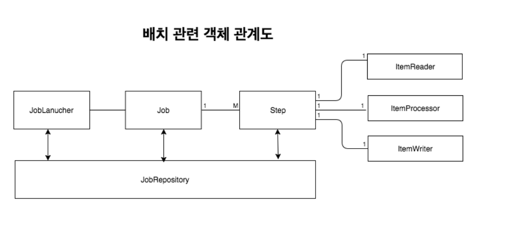

#스프링 배치 

##스프링 배치란
-  스프링 배치는 벡엔드의 배치처리 기능을 구현하는 데 사용하는 프레임워크입니다.  
 스프링 부트 배치는 스프링 배치 설정 요소들을 간편화시켜 스프링 배치를 빠르게 설정하는 데 도움을 줍니다.
   
### 특징
1. 대용량 데이터 - 배치 어플리케이션은 대량의 데이터를 가져오거나, 전달하거나, 계산하는 등의 처리를 할 수 ​​있어야 합니다.
2. 자동화 - 배치 어플리케이션은 심각한 문제 해결을 제외하고는 사용자 개입 없이 실행되어야 합니다.
3. 견고성 - 배치 어플리케이션은 잘못된 데이터를 충돌/중단 없이 처리할 수 있어야 합니다.
4. 신뢰성 - 배치 어플리케이션은 무엇이 잘못되었는지를 추적할 수 있어야 합니다. (로깅, 알림)
5. 성능 - 배치 어플리케이션은 지정한 시간 안에 처리를 완료하거나 동시에 실행되는 다른 어플리케이션을 방해하지 않도록 수행되어야합니다.

### 장점
1. 대용량 데이터 처리에 최적화되어 고성능을 발휘합니다.
2. 효과적인 로깅, 통계 처리, 트랜잭션 관리 등 재사용 가능한 필수 기능을 지원합니다.
3. 수동으로 처리하지 않도록 자동화되어 있습니다.
4. 예외사항과 비정상 동작에 대한 방어 기능이 있습니다.
5. 스프링 부트 배치는 반복적인 작업 프로세스를 이해하면 비니지스로직에 집중할 수 있습니다.

### 배치 이해하기
배치는 일반적으로 3단계로 이루어집니다.

1. 읽기(read) : 데이터 저장소(일반적으로 데이터베이스)에서 특정 데이터 레코드를 읽습니다.
2. 처리(processing) : 원하는 방식으로 데이터 가공/처리 합니다.
3. 쓰기(write) : 수정된 데이터를 다시 저장소(데이터베이스)에 저장합니다.

- Job과 Step은 1:M
- Step과 ItemReader, ItemProcessor, ItemWriter 1:1
- Job이라는 하나의 큰 일감(Job)에 여러 단계(Step)을 두고, 각 단계를 배치의 기본 흐름대로 구성합니다.