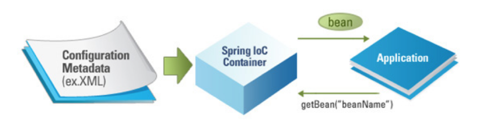
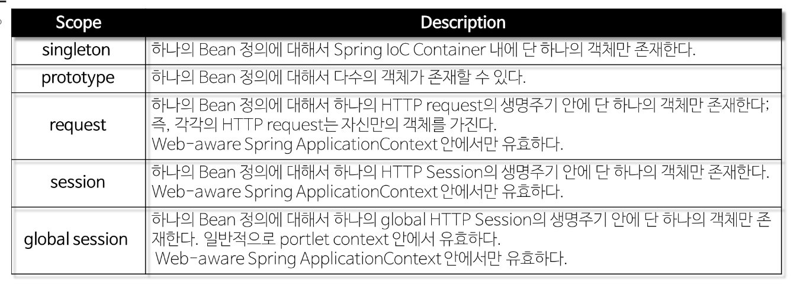
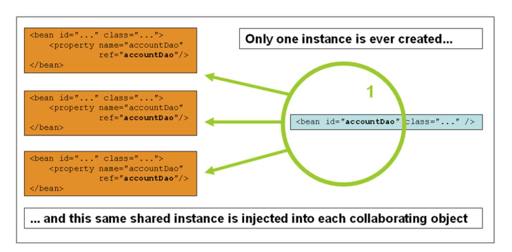
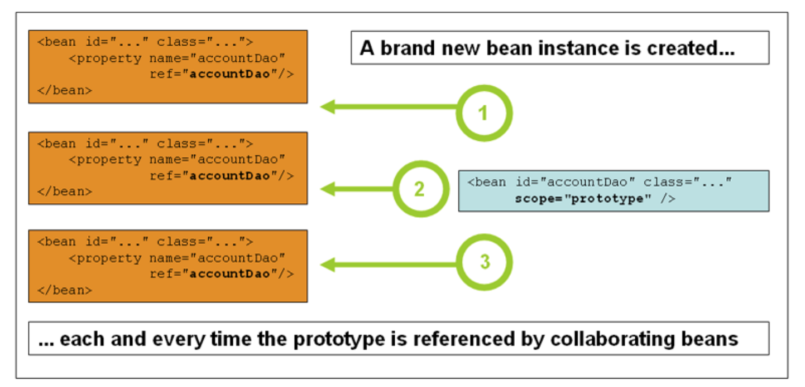

#Bean

## Bean이란

- Spring에서 POJO(plain, old java object)를 ‘Beans’라고 부른다.  
- Beans는 애플리케이션의 핵심을 이루는 객체이며, Spring IoC(Inversion of Control) 컨테이너에 의해 인스턴스화, 관리, 생성된다.  
- Beans는 우리가 컨테이너에 공급하는 설정 메타 데이터(XML 파일)에 의해 생성된다.  
- 컨테이너는 이 메타 데이터를 통해 Bean의 생성, Bean Life Cycle, Bean Dependency(종속성) 등을 알 수 있다.  
- 애플리케이션의 객체가 지정되면, 해당 객체는 getBean() 메서드를 통해 가져올 수 있다.  

Spring Bean 정의
일반적으로 XML 파일에 정의한다.
- 주요 속성
    - class(필수): 정규화된 자바 클래스 이름
    - id: bean의 고유 식별자
    - scope: 객체의 범위 (sigleton, prototype)
    - constructor-arg: 생성 시 생성자에 전달할 인수
    - property: 생성 시 bean setter에 전달할 인수
    - init method와 destroy method
    
선언 예제 
~~~
<!-- A simple bean definition -->
<bean id="..." class="..."></bean>

<!-- A bean definition with scope-->
<bean id="..." class="..." scope="singleton"></bean>

<!-- A bean definition with property -->
<bean id="..." class="...">
	<property name="message" value="Hello World!"/>
</bean>

<!-- A bean definition with initialization method -->
<bean id="..." class="..." init-method="..."></bean>
~~~

## SCOPE

스프링은 기본적으로 모든 bean을 singleton으로 생성하여 관리한다.
 - request, session, global session의 Scope는 일반 Spring 어플리케이션이 아닌, Spring MVC Web Application에서만 사용된다.

1. Singleton
    - singletondms Spring 컨테이너에서 한번 생성된다.
    - 컨테이너가 사라질 때 baen도 제거된다.
    - 생성된 하나의 인스턴스는 single bean cache에 저장되고, 해당 bean을 호출, 참조할 때 캐시된 객체를 반환

2. Prototype
    - 모든 요청에 새로운 객체를 생성하는 것을 의미한다.
    - gc에 의해 bean이 제거된다 
 

