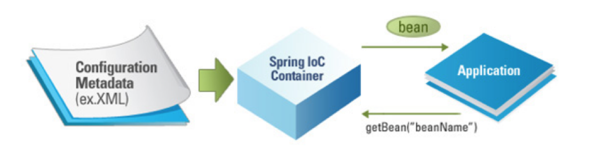

#Bean

## Bean이란

- Spring에서 POJO(plain, old java object)를 ‘Beans’라고 부른다.  
- Beans는 애플리케이션의 핵심을 이루는 객체이며, Spring IoC(Inversion of Control) 컨테이너에 의해 인스턴스화, 관리, 생성된다.  
- Beans는 우리가 컨테이너에 공급하는 설정 메타 데이터(XML 파일)에 의해 생성된다.  
- 컨테이너는 이 메타 데이터를 통해 Bean의 생성, Bean Life Cycle, Bean Dependency(종속성) 등을 알 수 있다.  
- 애플리케이션의 객체가 지정되면, 해당 객체는 getBean() 메서드를 통해 가져올 수 있다.  
