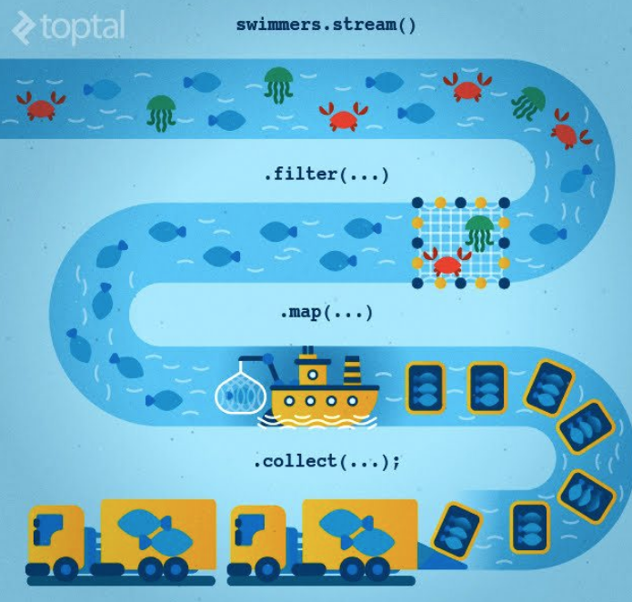

#Stream

자바 8에서 추가한 스트림(Streams)은 람다를 활용할 수 있는 기술 중 하나입니다.   
자바 8 이전에는 배열 또는 컬렉션 인스턴스를 다루는 방법은 for 또는 foreach 문을 돌면서 요소 하나씩을 꺼내서 다루는 방법이었습니다.   
간단한 경우라면 상관없지만 로직이 복잡해질수록 코드의 양이 많아져 여러 로직이 섞이게 되고,   
메소드를 나눌 경우 루프를 여러 번 도는 경우가 발생합니다.  

스트림은 '데이터의 흐름’입니다. 배열 또는 컬렉션 인스턴스에 함수 여러 개를 조합해서 원하는 결과를 필터링하고 가공된 결과를 얻을 수 있습니다.   
또한 람다를 이용해서 코드의 양을 줄이고 간결하게 표현할 수 있습니다.   
즉, 배열과 컬렉션을 함수형으로 처리할 수 있습니다.

스트림에 대한 내용은 크게 세 가지로 나눌 수 있습니다.

1. 생성하기 : 스트림 인스턴스 생성.
2. 가공하기 : 필터링(filtering) 및 맵핑(mapping) 등 원하는 결과를 만들어가는 중간 작업(intermediate operations).
3. 결과 만들기 : 최종적으로 결과를 만들어내는 작업(terminal operations).

물고기들은 바닷속에서 헤엄치며 앞으로 나아가다가 어부가 놓은 그물에 잡히고, 일정한 규격의 상자에 담긴 후 한꺼번에 모아 최종 소비자에게 전달된다.  
이를 stream과 대응시켜보자.  
우선, 바다 생물들의 이동은 stream이다.  
상품가치가 있는 물고기를 잡기위해 그물로 필터링 하는것은 filter라는 중간 연산자이고, 필터링 조건은 람다 함수 또는 메소드 참조를 통해 결정된다.  
물고기를 상자에 담는 과정 또한 중간 연산자 중 하나로, map이라고 한다. 이 과정에서 물고기를 차량(컬렉션)에 적재하기 적당한 형태로 가공된다.  
마지막으로, 물고기가 실린 수많은 상자를 차에 실어서 소비자에게 제공하는데, 이러한 행위가 collect라는 최종 연산자 이다.   
이렇게 보니 간단하다. 수많은 데이터의 흐름 속에서 각각의 값을 원하는 형태로 가공하여 최종 소비자에게 제공하는 것이 stream의 역할이다.  

## 생성방법
- Arrays.stream()
~~~
String[] arr = new String[] {"Hello", "World", "Hell"};
Stream<String> stream = Arrays.stream(arr); // 배열
Stream<String> streamOfArrayPart = Arrays.stream(arr, 1, 3); // 부분 배열
~~~
- Collections.stream()
컬렉션 타입 (Collection, List, Set)은 메소드를 이용하여 스트림을 생성할 수 있다.
~~~
List<String> list = Arrays.asList("a", "b", "c");
Stream<String> stream = list.stream();
Stream<String> parallelStream = list.parallelStream(); 
~~~
- 직접 생성하는 연산자
  - empty()
  null 대신 이용할 수 있다.
  ~~~
  Stream stream = Stream.empty();
  build()
  Stream<String> generatedStream = Stream.<String>builder()
          .add("Hello")
          .add("World")
          .build();
  ~~~
  - generate()
  크기를 지정하지 않으면 무한하기 때문에 특정 사이즈만큼 생성하려면 반드시 limit을통해 최대 크기를 제한해야 한다.
  ~~~
  Stream<String> generatedStream = Stream.generate(() -> "gen").limit(5);
  ~~~
  - iterate()
  초기 값을 시작으로 계속해서 2씩 증가된 값을 생성한다. generate()와 마찬가지로 크기를 지정하지 않으면 무한하기 때문에 limit을 통해 크기를 제한해야 한다.
  ~~~
  Stream<Integer> iteratedStream = Stream.iterate(30, n -> n + 2).limit(5);
  ~~~
  - 기본 타입형 스트림
  IntStream, LongStream, DoubleStream  
  제네릭을 사용하지 않고 기본 값을 생성하는 방법이다.   제네릭을 사용하지 않기 때문에 불필요한 오토 박싱(auto-boxing)이 발생하지 않는다.
  
  range는 [startPosition, endPosition) 범위를 가진다.  
  rangeClosed는 [startPosition, endPosition] 범위를 가진다.
  ~~~  
  IntStream intStream = IntStream.range(1, 5); // [1, 2, 3, 4]
  LongStream longStream = LongStream.rangeClosed(1, 5); // [1, 2, 3, 4, 5]
  ~~~
  필요한 경우 boxed 메서드를 통해 Integer 형태로 박싱할 수 있다.
  ~~~
  Stream<Integer> boxedIntStream = IntStream.range(1, 5).boxed();
  ~~~
  난수 스트림을 생성할 수도 있다.  
  DoubleStream doubles = new Random().doubles(3); // 난수 3개 생성

