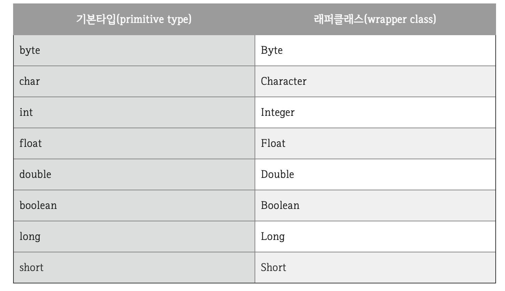
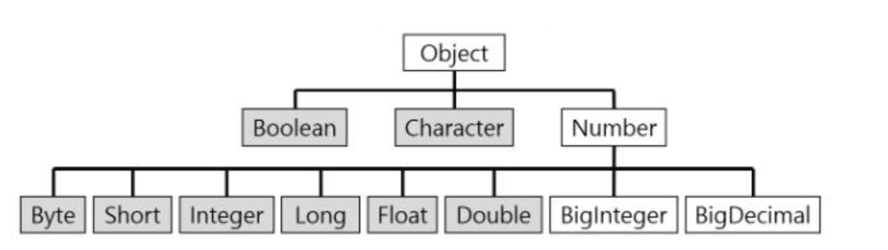

#Wrapper 클래스
자바의 자료형은 크게 기본 타입(primitive type)과 참조 타입(reference type)으로 나누어집니다.   
대표적으로 기본 타입은 char, int, float, double, boolean 등이 있고   
참조 타입은 class, interface 등이 있는데 프로그래밍을 하다 보면 기본 타입의 데이터를 객체로 표현해야 하는 경우가 종종 있습니다.   
이럴 때에 기본 자료타입(primitive type)을 객체로 다루기 위해서 사용하는 클래스들을 래퍼 클래스(wrapper class)라고 합니다.   
자바는 모든 기본타입(primitive type)은 값을 갖는 객체를 생성할 수 있습니다. 이런 객체를 포장 객체라고도 하는데 그 이유는 기본 타입의 값을 내부에 두고 포장하기 때문입니다.   
래퍼 클래스로 감싸고 있는 기본 타입 값은 외부에서 변경할 수 없습니다. 만약 값을 변경하고 싶다면 새로운 포장 객체를 만들어야 합니다.

## 종류

## 구조도

위의 계층 구조에서 볼 수 있듯 모든 래퍼 클래스의 부모는 Object이고 내부적으로 숫자를 다루는 래퍼클래스의 부모 클래스는 Number 클래스입니다.   
모든 래퍼 클래스는 최종 클래스로 정의됩니다.

## 박싱, 언박싱
기본 타입의 값을 포장 객체로 만드는 과정을 박싱이라고 하고 반대로 포장객체에서 기본타입의 값을 얻어내는 과정을 언박싱이라고 합니다. 
~~~
public class Wrapper_Ex {
    public static void main(String[] args)  {
        Integer num = new Integer(17); // 박싱
        int n = num.intValue(); //언박싱
        System.out.println(n);
    }
}
~~~

##자동 박싱(AutoBoxing)과 자동 언박싱(AutoUnBoxing)
기본타입 값을 직접 박싱, 언박싱하지 않아도 자동적으로 박싱과 언박싱이 일어나는 경우가 있습니다.   
자동 박싱의 포장 클래스 타입에 기본값이 대입될 경우에 발생합니다.   
예를 들어 int타입의 값을 Integer클래스 변수에 대입하면 자동 박싱이 일어나 힙 영역에 Integer객체가 생성됩니다.

~~~
public class Wrapper_Ex {
    public static void main(String[] args)  {
        Integer num = 17; // 자동 박싱
        int n = num; //자동 언박싱
        System.out.println(n);
    }
}
~~~

## 사용이유
1. 매개변수 객체가 요구 될때.
2. 기본형 이 아닌 객체로 저장해야 할 때.
3. 객체간의 비교가 필요할 때. 등등
4. 컬랙션에선 제네릭에서 객체가 필요함
    - 왜 컬랙션에선 객체만 받느냐?
     collection에서 원시타입을 허용하면
     예를들어 intlist,doublelist가 각각 다 필요하고
     래퍼,리퍼런스로 받으면 오브젝트 상속한 형태는 다됨으로 1개만 있으면 돼서 인듯 하다.
      사용하는 이유
5. 기본 데이터 타입을 Object로 변환할 수 있다.
6. java.util 패키지의 클래스는 객체만 처리하므로 Wrapper class는 이 경우에도 도움이 된다.
7. ArrayList 등과 같은 Collection Framework의 데이터 구조는 기본 타입이 아닌 객체만 저장하게 되고, Wrapper class를 사용하여 자동박싱/언박싱이 일어난다.
8. 멀티스레딩에서 동기화를 지원하려면 객체가 필요하다.