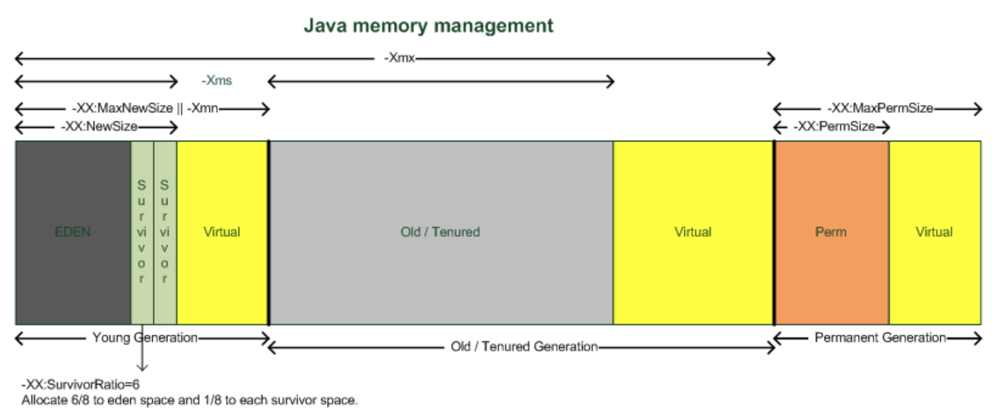
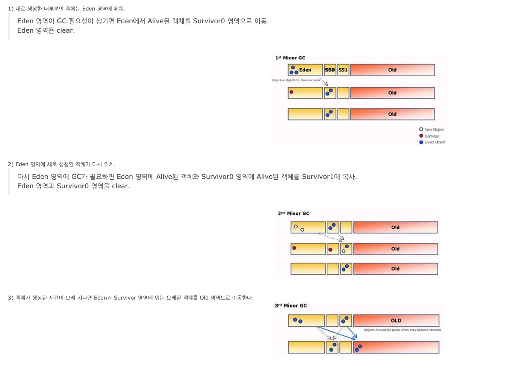

#가비지 컬렉터(GC)
자바에서는 메모리를 GC라는 알고리즘을 통하여 관리(automatic memory management)하기 때문에,   
개발자가 힙메모리를 처리하기 위한 로직을 만들 필요가 없고, 절대로 만들어서는 안됩니다.

Garbage Collection. 자바에서 쓰레기는 객체입니다. 하나의 객체는 힙메모리를 점유하고,   
필요하지 않으면 힙메모리에서 해제되어야 합니다. 메모리 점유는 다음과 같이 쉽게 할 수 있습니다.

이러한 코드에서 a라는 객체가 만들어져 힙메모리의 한부분을 점유하게 되고, 특정 메소드 호출한 후 수행이 완료되어 해당 객체가 더이상 필요없는 객체, 쓰레기가 됩니다.   
이 쓰레기 객체를 효과적으로 처리하는 작업을 GC라고 합니다.

## GC의 원리
GC가 하는 역할은 다음과 같다.
1. 메모리할당
2. 사용중인 메모리 인식
3. 사용하지 않는 메모리 인식

JVM메모리는 크게 클래스영역, 자바스택, 힙, 네이티브 메소드 스택 4개영역으로 나뉘는데 GC는 힙영역에 대하여 메모리 할당을 정리하는 것이다.

힙은 Young, Old, Perm 세 영역으로 나뉜다.
이 중 Perm(Permanent) 영역은 거의 사용되지 않는 영역으로서 클래스와 메소드 정보와 같이 자바 언어 레벨에서 사용되지 않습니다.   
Yong, Old 영역 그리고 Young 영역은 Eden영역과 두 개의 Survivor 영역으로 나뉩니다.   
우리가 고려해야 할 자바의 메모리 영역은 총 4개의 영역으로 나뉜다고 볼 수 있습니다.  ( Young (1. Eden, 2. Survivor 1, 3. Survivor 2), Old (4. 메모리) )

#### GC 순서

일단 메모리에 객체가 생성되면, Eden 영역에 객체가 지정됩니다.  Eden 영역에 데이터가 어느 정도 쌓이면,   
이 영역에 있던 객체가 어디론가 옮겨지거나 삭제됩니다. 이 때 옮겨가는 위치가 survivor 영역입니다.   
두개의 Survivor 영역 사이에 우선 순위가 있는 것은 아닙니다. 하지만, 이 두 개의 영역 중 한 영역은 반드시 비어 있어야 합니다.   
그 비어있는 영역에 Eden 영역에 있던 객체가 할당됩니다.

Eden에서 survivor 둘 중 하나의 영역으로 할당 되고, 할당된 Survivor 영역이 차면,   
GC가 되면서 Eden 영역에 있는 객체와 꽉 찬 Survivor 영역에 있는 객체가 비어 있는 Survivor 영역으로 이동합니다.   
그러다가 더 큰 객체가 생성되거나, 더 이상 Young 영역에 공간이 남지 않으면 객체들은 Old 영역으로 이동하게 됩니다.

#### GC 알고리즘 
- Reference Counting Algorithm
    - Garbage의 Detection에 초점이 맞추어진 초기 Algorithm이다. 각 Object마다 Reference Count를 관리하여 Reference Count가 0이 되면 GC를 수행한다.
    - 장점
        - Reference Count가 0이 될 때마다 GC가 발생하기 때문에 Pause Time이 분산되어 실시간 작업에도 거의 영향을 주지 않고 즉시 메모리에서 해제된다
    - 단점
        - 각 Object마다 Count를 계속 변경 해야한다.
        - 참조가 많이 되어있는 Object는 연쇄적으로 GC가 발생
        - Linked List와 같은 순환구조에서 Memory leak 발생
        
- Mark-and-Sweep Alogrithm
    - Mark Phase와 Sweep Phase로 나뉘게 된다.
    - Mark에서는 살아 남아야 할 Object를 Marking 한다
    - Sweep 에서는 마킹이 없는 Object를 삭제한다.
    - Sweep 후에는 Marking을 초기화 한다.
    - GC가 수행되는 도중 Mark 작업의 정확성과 Memory Corruption을 방지하기 위해 Heap의 사용이 제한되기 때문에 Suspend 현상이 발생한다.
    - 사용하지 않는 Object를 지웠지만 Fragmentation(조각)이 발생하여 OOME가 발생한다.
    
- Mark-and-Compact Algorithm
    - 위의 알고리즘의 조각현상을 방지하기 위해 탄생했다.
    - 위의 알고리즘과 동일 하지만 조각현상을 없애기 위해 Compact Phase가 추가 되었다.
    - Compaction 작업 이후 살아남은 모든 Object들의 Reference를 업데이트하는 작업이 필요하기 때문에 부가적인 Overhead가 수반된다
    
- Copying Algorithm
    - 해당 알고리즘도 조각현상을 방지하기위해 제시된 다른 방법이다.
    - 현대의 GC가 차용하고 있는데 Generational이 해당 알고리즘의 발전형이다.
    - Heap을 Active 영역과 InActive 영역으로 나누어 Active 영역에만 Object를 할당할 수 있게 하고 Active 영역이 꽉 차게 되면 GC를 수행한다는 것이다. 
    - 살아남은 Live Object를 Inactive영역에 Copy 한다.
    - Copy 하는 동안 프로그램이 Suspend 상태가 되기 때문에 Stop-the-Coyping이라고도 부른다.
    - Fragmentation 방지에는 효과적이지만 전체 Heap의 절반 정도밖에 사용하지 못한다는 공간 활용의 비효율성,  
      Suspend 현상, Copy에 대한 Overhead가 존재한다는 단점이 있다.
      
- Generational Algorithm
    - 오늘날 사용하는 GC 알고리즘
    - 이 알고리즘은 두가지 가설 하에 만들어졌다(가정 또는 전제조건이 맞는 단어같다)
        - 대부분의 객체는 금방 접근 불가능 상태(unreachable)가 된다.
        - 오래된 객체에서 젊은 객체로의 참조는 아주 적게 존재한다. 
        
    - 이러한 가설을 'weak generational hypothesis'라 한다.   
      이 가설의 장점을 최대한 살리기 위해서 HotSpot VM에서는 크게 2개로 물리적 공간을 나누었다.   
      둘로 나눈 공간이 Young 영역과 Old 영역이다.
      
    - Young 영역의 구성
        - GC를 이해하기 위해서 객체가 제일 먼저 생성되는 Young 영역부터 알아보자. Young 영역은 3개의 영역으로 나뉜다.
            - Eden 영역
          - Survivor 영역(2개)
      - Survivor 영역이 2개이기 때문에 총 3개의 영역으로 나뉘는 것이다. 각 영역의 처리 절차를 순서에 따라서 기술하면 다음과 같다.
          - 새로 생성한 대부분의 객체는 Eden 영역에 위치한다.
          - Eden 영역에서 GC가 한 번 발생한 후 살아남은 객체는 Survivor 영역 중 하나로 이동된다.
          - Eden 영역에서 GC가 발생하면 이미 살아남은 객체가 존재하는 Survivor 영역으로 객체가 계속 쌓인다.
          - 하나의 Survivor 영역이 가득 차게 되면 그 중에서 살아남은 객체를 다른 Survivor 영역으로 이동한다. 그리고 가득 찬 Survivor 영역은 아무 데이터도 없는 상태로 된다.
          - 이 과정을 반복하다가 계속해서 살아남아 있는 객체는 Old 영역으로 이동하게 된다.
      - Young 영역에서 발생하는 GC를 Minor GC라 칭한다.

    - Old 영역에 대한 GC
        - Old 영역에서 발생하는 GC를 Major GC라 칭한다.
        - Old 영역은 기본적으로 데이터가 가득 차면 GC를 실행한다. GC 방식에 따라서 처리 절차가 달라지므로,   
            어떤 GC 방식이 있는지 살펴보면 이해가 쉬울 것이다. GC 방식은 JDK 7을 기준으로 5가지 방식이 있다.
            - Serial GC
                - 운영서버에서 절대 사용 하면 안된다.
                - CPU코어가 하나만 있을 때 사용 하기 위한 방식, 어플리케이션 성능이 매우 떨어진다.
                - Young에서는 Generational을 사용하고 Old 영역의 GC는 mark-sweep-compact이라는 알고리즘을 사용한다.
                - 적은 메모리와 CPU 코어 개수가 적을 때 적합한 방식이다.
                
            - Parallel GC
                - Serial GC와 사용하는 알고리즘은 같다.
                - Parallel GC는 GC를 처리하는 쓰레드가 여러 개이다
                - 그래서 Serial GC 보다 빠르다.
                - JDK6, 7 Default
 
            - Parallel Old GC(Parallel Compacting GC)
                - JDK 5 update 6부터 제공한 GC 방식
                - Parallel GC와 비교하여 Old 영역의 GC 알고리즘만 다르다. 이 방식은 Mark-Summary-Compaction 단계를 거친다.
                
            - Concurrent Mark & Sweep GC(이하 CMS)
                - CMS GC는 stop-the-world 시간이 짧다는 장점에 반해 다음과 같은 단점이 존재한다.
                    - 다른 GC 방식보다 메모리와 CPU를 더 많이 사용한다.
                    - Compaction 단계가 기본적으로 제공되지 않는다.
                    
            - G1(Garbage First) GC
                - G1 GC는 바둑판의 각 영역에 객체를 할당하고 GC를 실행한다.
                - 지금까지 설명한 Young의 세가지 영역에서 데이터가 Old 영역으로 이동하는 단계가 사라진 GC 방식이라고 이해하면 된다. 
                - JDK 9부터 Default 됨   
- 참조
    - https://d2.naver.com/helloworld/1329
    - https://medium.com/@joongwon/jvm-garbage-collection-algorithms-3869b7b0aa6f
    - https://d2.naver.com/helloworld/329631
    - https://12bme.tistory.com/57
    - https://velog.io/@litien/%EA%B0%80%EB%B9%84%EC%A7%80-%EC%BB%AC%EB%A0%89%ED%84%B0GC
    - https://yaboong.github.io/java/2018/05/26/java-memory-management/
    - http://www.libqa.com/wiki/77