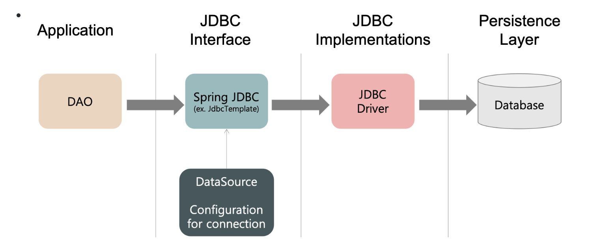
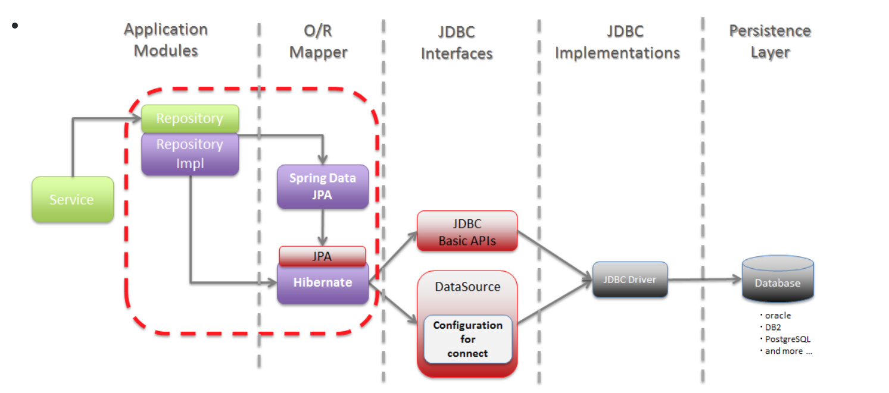
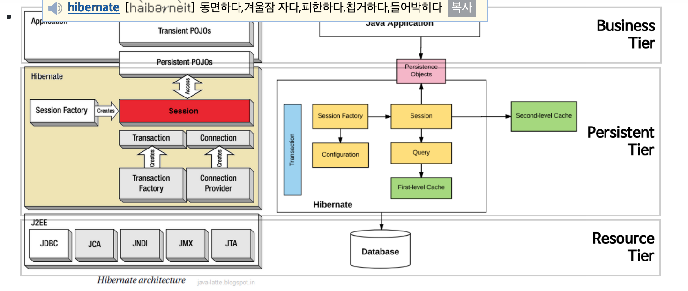
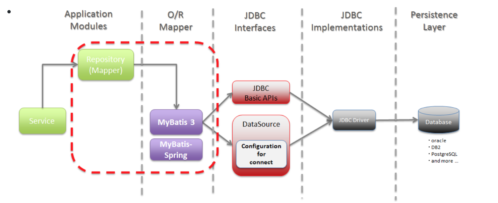

#JDBC, JPA/Hibernate, Mybatis의 차이

#### 영속성(Persistence)
- 데이터를 생성한 프로그램이 종료되어도 사라지지 않는 데이터의 특성
- 영속성이 없는 데이터는 메모리에만 존재 하기에 프로그램이 종료하면 사라진다.
- Persistence Layer
    - 프로그램의 아키텍처에서, 데이터에 영속성을 부여해주는 계층을 말한다.
    - JDBC를 이용하여 직접 구현할 수 있지만 Persistence framework를 이용한 개발이 많이 이루어진다.
- Persistence Framework
    - JDBC 프로그래밍의 복잡함이나 번거로움 없이 간단한 작업만으로 데이터베이스와 연동되는 시스템을 빠르게 개발할 수 있으며 안정적인 구동을 보장
    - SQL Mapper와 ORM으로 나눌 수 있다.
    
#### SQL Mapper와 ORM
 
- ORM은 데이터베이스 객체를 자바 객체로 매핑함으로써 객체간의 관계를 바탕으로 SQl을 자동으로 생성해주고 SQL Mapper는 실질적인 SQL을 작성해야한다. 
- ORM은 RDBMS의 관계를 Object에 반영하자는 것이 목적, SQL Mapper는 필드를 DTO에 매핑시키는 것이 목적 

1)  SQL Mapper
    - SQL <—매핑—> Object 필드
    - SQL Mapper는 SQL 문장으로 직접 데이터베이스 데이터를 다룬다.  
        즉, SQL Mapper는 SQL을 명시해줘야 한다.  
        Ex) Mybatis, JdbcTempletes 등  
2) ORM(Object-Relational Mapping), 객체 관계매핑
    - 데이터베이스 데이터 <—매핑—> Object 필드
        - 객체를 통해 간접적으로 데이터베이스 데이터를 다룬다.
    - 객체와 관계형 데이터베이스의 데이터를 자동으로 매핑(연결)해주는 것을 말한다.
        - ORM을 이용하면 SQL Query가 아닌 직관적인 코드(메서드)로 데이터를 조작할 수 있다.
        - 객체 간의 관계를 바탕으로 SQL을 자동으로 생성한다.
    - Persistant API라고도 할 수 있다.  
      Ex) JPA, Hibernate 등
    
    - 장점 - 왜 사용하는가?
        - **객체 지향적인 코드로 인해 더 직관적이고 비즈니스 로직에 더 집중할 수 있게 도와준다.**
          - 선언문, 할당, 종료 같은 부수적인 코드가 없거나 급격히 줄어든다.
          - 각종 객체에 대한 코드를 별도로 작성하기 때문에 코드의 가독성을 올려준다.
          - SQL의 절차적이고 순차적인 접근이 아닌 객체 지향적인 접근으로 인해 생산성이 증가한다.
        - **재사용 및 유지보수의 편리성이 증가한다.**
          - ORM은 독립적으로 작성되어있고, 해당 객체들을 재활용 할 수 있다.
          - 때문에 모델에서 가공된 데이터를 컨트롤러에 의해 뷰와 합쳐지는 형태로 디자인 패턴을 견고하게 다지는데 유리하다.
          - 매핑정보가 명확하여, ERD를 보는 것에 대한 의존도를 낮출 수 있다.
        - **DBMS에 대한 종속성이 줄어든다.**
          - 대부분 ORM 솔루션은 DB에 종속적이지 않다.
          - 종속적이지 않다는것은 구현 방법 뿐만아니라 많은 솔루션에서 자료형 타입까지 유효하다.
          - 프로그래머는 Object에 집중함으로 극단적으로 DBMS를 교체하는 거대한 작업에도 비교적 적은 리스크와 시간이 소요된다.
          - 또한 자바에서 가공할경우 equals, hashCode의 오버라이드 같은 자바의 기능을 이용할 수 있고, 간결하고 빠른 가공이 가능하다.
    
    - 단점
        - **완벽한 ORM 으로만 서비스를 구현하기가 어렵다.**
          - 사용하기는 편하지만 설계는 매우 신중하게 해야한다.
          - 프로젝트의 복잡성이 커질경우 난이도 또한 올라갈 수 있다.
          - 잘못 구현된 경우에 속도 저하 및 심각할 경우 일관성이 무너지는 문제점이 생길 수 있다.
          - 일부 자주 사용되는 대형 쿼리는 속도를 위해 SP를 쓰는등 별도의 튜닝이 필요한 경우가 있다.
          - DBMS의 고유 기능을 이용하기 어렵다. (하지만 이건 단점으로만 볼 수 없다 : 특정 DBMS의 고유기능을 이용하면 이식성이 저하된다.)
        - **프로시저가 많은 시스템에선 ORM의 객체 지향적인 장점을 활용하기 어렵다.**
          - 이미 프로시저가 많은 시스템에선 다시 객체로 바꿔야하며, 그 과정에서 생산성 저하나 리스크가 많이 발생할 수 있다.
          
#### JDBC(Java Database Connectivity)

- JDBC는 DB에 접근할 수 있도록 Java에서 제공하는 API이다.
    - 모든 Java의 Data Access 기술의 근간
    - 즉, 모든 Persistence Framework는 내부적으로 JDBC API를 이용한다.
- JDBC는 데이터베이스에서 자료를 쿼리하거나 업데이트하는 방법을 제공한다.

#### JPA(Java Persistent API)

- 자바 ORM 기술에 대한 API 표준 명세로, Java에서 제공하는 API이다.
    - JPA는 ORM을 사용하기 위한 표준 인터페이스! 구현체가 아니다.
    - 기존에 EJB에서 제공되던 엔터티 빈(Entity Bean)을 대체하는 기술이다.
- JPA 구성요소 (3가지)
    1) javax.persistance 패키지로 정의된 API 그 자체
    2) JPQL(Java Persistence Query Language)
    3) 객체/관계 메타데이터
- 사용자가 원하는 JPA 구현체를 선택해서 사용할 수 있다.
    - JPA의 대표적인 구현체로는 Hibernate, EclipseLink, DataNucleus, OpenJPA, TopLink Essentials 등이 있다.
    - 이 구현체들을 ORM Framework라고 부른다.
    
#### Hibernate

- JPA의 구현체중 하나이다.
- SQL을 개발자가 직접 만들지는 않지만 JDBC API를 사용하여 자동으로 생성해주는 것이다.
- HQL(Hibernate Query Language)이라 불리는 매우 강력한 쿼리 언어를 포함하고 있다.
- 장점
    - 객체지향적으로 데이터를 관리할 수 있기 때문에 비즈니스 로직에 집중 할 수 있으며, 객체지향 개발이 가능하다.
    - 테이블 생성, 변경, 관리가 쉽다. (JPA를 잘 이해하고 있는 경우)
    - 로직을 쿼리에 집중하기 보다는 객체자체에 집중 할 수 있다.
    - 빠른 개발이 가능하다.
- 단점
    - 어렵다. (많은 내용이 감싸져 있기 때문에 알아야 할 것이 많다.)
    - 잘 이해하고 사용하지 않으면 데이터 손실이 있을 수 있다. (persistence context)
    - 성능상 문제가 있을 수 있다. (이 문제 또한 잘 이해해야 해결이 가능하다.) N+1 문제같은...
    
#### Mybatis

- 개발자가 지정한 SQL, 프로시저 , 고급매핑을 지원하는 SQL Mapper이다.
- JDBC로 처리하는 상당 부분의 코드와 파라미터 설정 및 결과 매핑을 대신해준다.
- 데이터베이스 record에 원시 타입과 Map 인터페이스 그리고 자바 POJO를 설정해서 매핑하기 위해 xml과 Annotation을 사용할 수 있다.
- MyBatis는 원래 Apache Foundation의 iBatis였으나, 생산성, 개발 프로세스, 커뮤니티 등의 이유로 Google Code로 이전되면서 이름이 바뀌었다.
  iBatis와 바뀐 차이점은 아래와 같다.
    - JDK 1.5, Annotation
    - Dynatic SQL, XML Element
- 장점
    - SQL에 대한 모든 컨트롤을 하고자 할때 매우 적합하다.
    - SQL쿼리들이 매우 잘 최적화되어 있을 때에 유용하다.
- 단점
    - 단순 CRUD를 모두 다 작성해야하는 번거로움이 있다.
    - 애플리케이션과 데이터베이스 간의 설계에 대한 모든 조작을 하고자 할 때는 적합하지 않다.
    -    애플리케이션과 데이터베이스 간에 서로 잘 구조화되도록 많은 설정이 바뀌어야 하기 때문이다.
